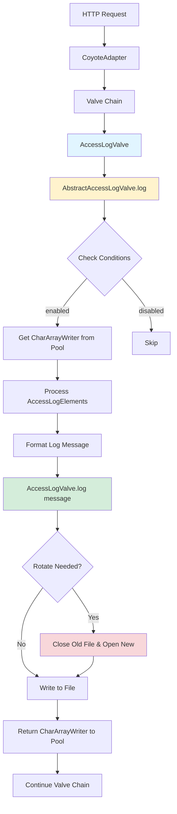
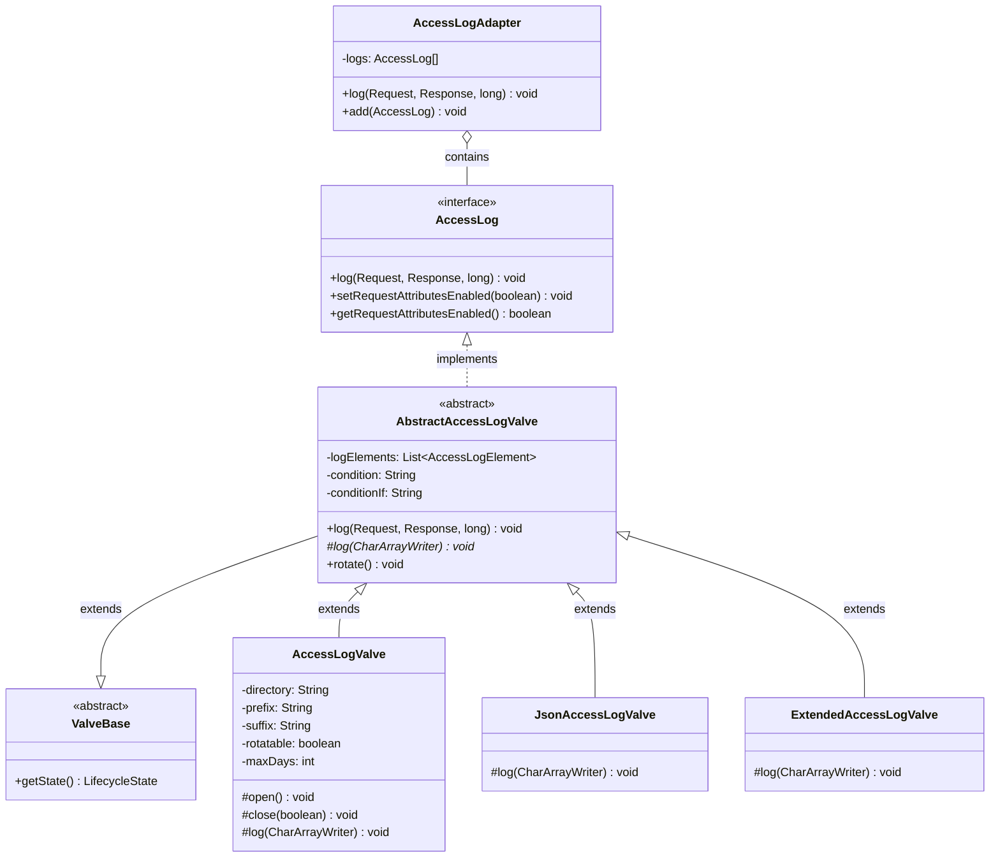
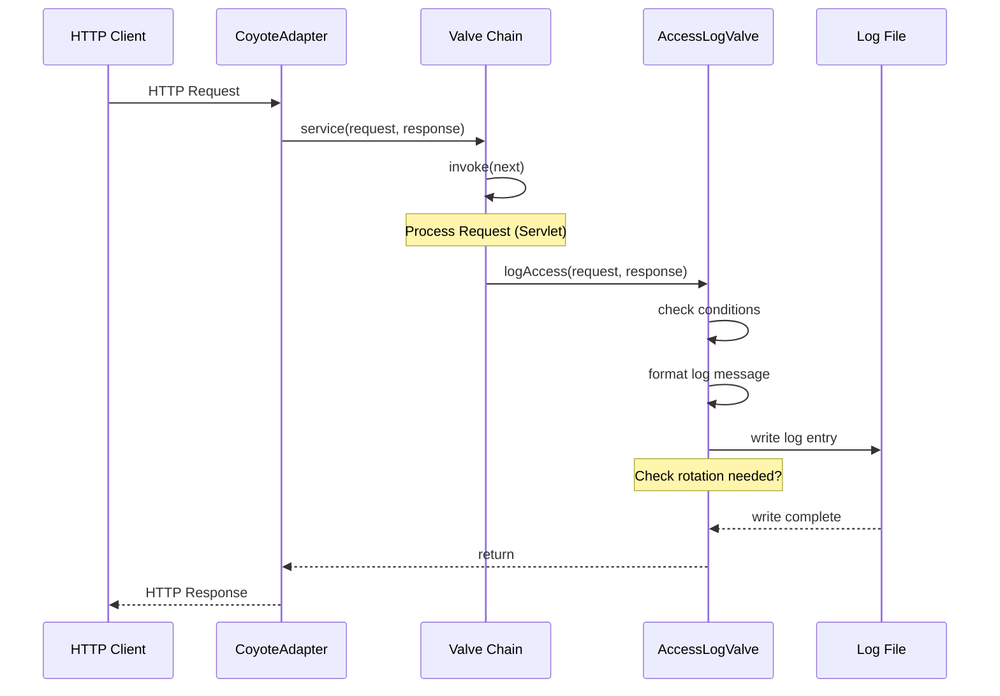
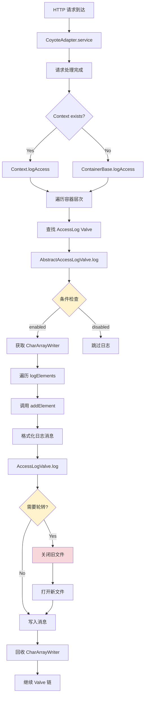
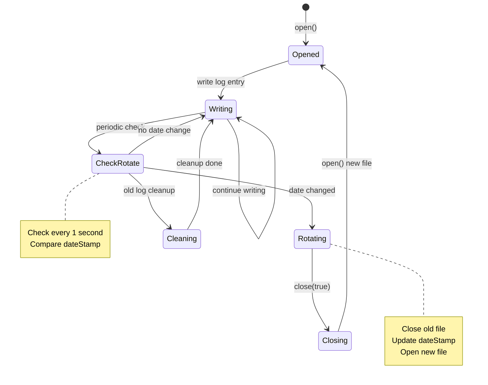
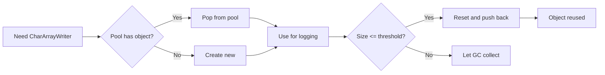
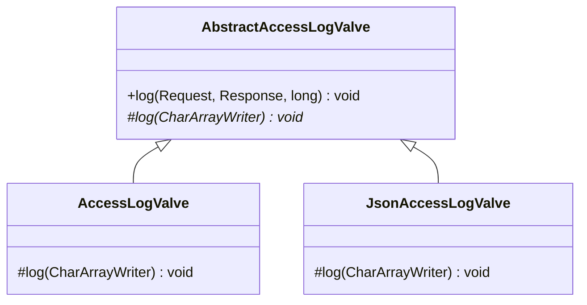
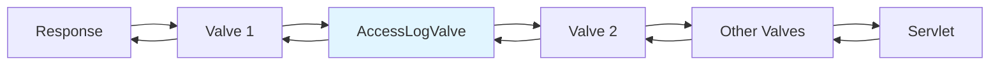
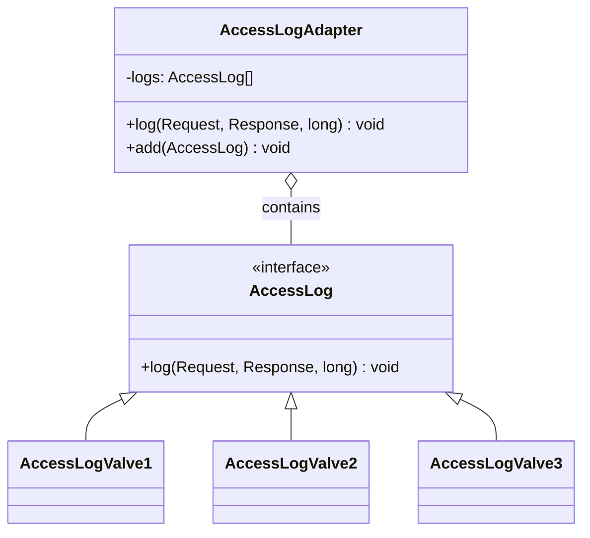
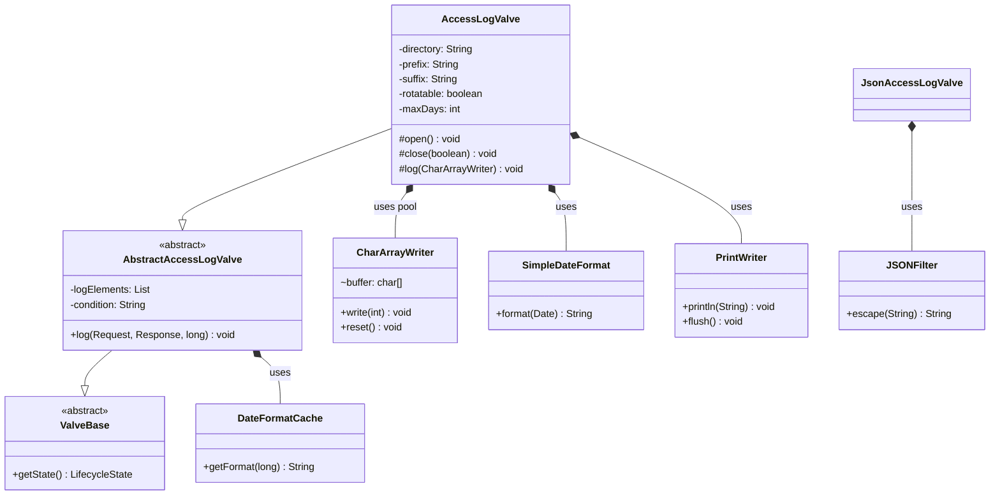

# Tomcat 访问日志(Access Log)架构

## 概述

Tomcat 的访问日志模块负责记录所有传入的 HTTP 请求信息，类似于 Apache HTTP Server 的 `mod_log_config` 模块。该模块基于 **Valve 责任链模式** 实现，在请求处理的各个阶段都可以记录访问日志。

**核心目的：**
- 记录每个 HTTP 请求的详细信息（IP、方法、URL、状态码、响应时间等）
- 支持可配置的日志格式模式
- 支持日志文件自动轮转和清理
- 提供多种输出格式（文本、JSON、扩展格式）

## 核心概念

- **Valve 责任链模式** - 访问日志作为请求处理链中的一个环节
- **可配置模式** - 使用占位符定制日志格式
- **自动轮转** - 基于日期的日志文件轮转
- **对象池复用** - CharArrayWriter 复用以提高性能
- **条件日志** - 支持基于请求属性的条件记录

## Visual Overview



## 模块结构



## 目录结构

```
java/org/apache/catalina/
├── AccessLog.java                      # 访问日志接口
├── core/
│   └── AccessLogAdapter.java           # 多日志适配器
└── valves/
    ├── AbstractAccessLogValve.java     # 抽象基类（核心逻辑）
    ├── AccessLogValve.java             # 标准文件输出实现
    ├── ExtendedAccessLogValve.java     # 扩展格式支持
    └── JsonAccessLogValve.java         # JSON 格式输出

test/org/apache/catalina/valves/
├── TestAccessLogValve.java             # 单元测试
├── TestAbstractAccessLogValveEscape.java
├── TestAccessLogValveDateFormatCache.java
├── TestExtendedAccessLogValve.java
└── TestExtendedAccessLogValveWrap.java
```

## 核心组件

### 1. AccessLog 接口

```java
// 位置: java/org/apache/catalina/AccessLog.java
public interface AccessLog {
    void log(Request request, Response response, long time);
    void setRequestAttributesEnabled(boolean requestAttributesEnabled);
    boolean getRequestAttributesEnabled();
}
```

**职责：** 定义访问日志的核心契约，所有访问日志实现必须实现此接口。

**关键常量：**
| 常量 | 用途 |
|------|------|
| `REMOTE_ADDR_ATTRIBUTE` | 覆盖记录的远程 IP 地址 |
| `REMOTE_HOST_ATTRIBUTE` | 覆盖记录的远程主机名 |
| `PROTOCOL_ATTRIBUTE` | 覆盖记录的协议 |
| `SERVER_NAME_ATTRIBUTE` | 覆盖记录的服务器名 |
| `SERVER_PORT_ATTRIBUTE` | 覆盖记录的端口 |

### 2. AbstractAccessLogValve (抽象基类)

这是访问日志的**核心实现**，包含：

**2.1 日志模式解析**

```java
// 支持的模式占位符
%a  - 远程 IP 地址
%A  - 本地 IP 地址
%b  - 发送字节数（不包括 HTTP 头），无字节发送时显示 '-'
%B  - 发送字节数（不包括 HTTP 头）
%h  - 远程主机名
%H  - 请求协议
%l  - 远程逻辑用户名（identd，总是返回 '-'）
%m  - 请求方法
%p  - 本地端口
%q  - 查询字符串
%r  - 请求的第一行
%s  - HTTP 响应状态码
%S  - 用户会话 ID
%t  - 日期和时间（Common Log Format）
%u  - 远程认证用户
%U  - 请求的 URL 路径
%v  - 本地服务器名
%D  - 请求处理时间（微秒）
%T  - 请求处理时间（秒）
%F  - 响应提交时间（毫秒）
%I  - 当前请求线程名
%X  - 连接状态（X=异常, +=保持连接, -=关闭连接）
```

**2.2 高级模式**

```
%{xxx}i  - 请求头 xxx 的值
%{xxx}o  - 响应头 xxx 的值
%{xxx}c  - Cookie xxx 的值
%{xxx}r  - ServletRequest 属性 xxx 的值
%{xxx}s  - HttpSession 属性 xxx 的值
%{xxx}t  - 自定义时间格式
%{xxx}L  - 标识符日志
%{xxx}T  - 自定义时间单位
```

**2.3 预定义模式别名**

```java
common:    %h %l %u %t "%r" %s %b
combined:  %h %l %u %t "%r" %s %b "%{Referer}i" "%{User-Agent}i"
```

**2.4 AccessLogElement 接口**

```java
protected interface AccessLogElement {
    void addElement(CharArrayWriter buf, Request request, Response response, long time);
}

protected interface CachedElement {
    void cache(Request request);
}
```

每个日志模式占位符都对应一个 `AccessLogElement` 实现类：

| Element 类 | 模式 | 功能 |
|-----------|------|------|
| `ThreadNameElement` | `%I` | 记录线程名 |
| `LocalAddrElement` | `%A` | 记录本地地址 |
| `RemoteAddrElement` | `%a` | 记录远程地址 |
| `HostElement` | `%h` | 记录远程主机 |
| `MethodElement` | `%m` | 记录请求方法 |
| `QueryStringElement` | `%q` | 记录查询字符串 |
| `RequestURIElement` | `%U` | 记录请求 URI |
| ... | ... | ... |

### 3. AccessLogValve (标准实现)

```java
// 位置: java/org/apache/catalina/valves/AccessLogValve.java
public class AccessLogValve extends AbstractAccessLogValve
```

**关键属性：**

```java
// 日志文件配置
private String directory = "logs";           // 日志目录
protected String prefix = "access_log";      // 文件前缀
protected String suffix = "";                // 文件后缀
protected String fileDateFormat = ".yyyy-MM-dd";  // 日期格式

// 日志轮转配置
protected boolean rotatable = true;          // 是否自动轮转
protected boolean renameOnRotate = false;    // 轮转时重命名
private boolean checkExists = false;         // 检查文件是否存在

// 输出配置
private boolean buffered = true;             // 是否缓冲
protected String encoding = null;            // 字符编码

// 日志清理
private int maxDays = -1;                    // 保留天数
```

**日志文件命名：**
```
{prefix}{dateStamp}{suffix}

例如: access_log.2025-03-12.txt
```

### 4. JsonAccessLogValve

```java
// 位置: java/org/apache/catalina/valves/JsonAccessLogValve.java
public class JsonAccessLogValve extends AccessLogValve
```

**功能：** 将访问日志以 JSON 格式输出，便于日志分析工具处理。

**输出示例：**
```json
{
  "remoteAddr": "192.168.1.100",
  "localAddr": "192.168.1.10",
  "size": 1234,
  "host": "client.example.com",
  "protocol": "HTTP/1.1",
  "method": "GET",
  "port": 8080,
  "query": "?param=value",
  "request": "GET /path HTTP/1.1",
  "statusCode": 200,
  "sessionId": "A1B2C3D4",
  "time": "12/Mar/2025:10:30:45 +0800",
  "elapsedTimeS": 0.125,
  "user": "admin",
  "path": "/api/data",
  "localServerName": "localhost"
}
```

### 5. AccessLogAdapter

```java
// 位置: java/org/apache/catalina/core/AccessLogAdapter.java
public class AccessLogAdapter implements AccessLog {
    private AccessLog[] logs;
}
```

**功能：** 组合多个 `AccessLog` 实例，实现日志的多路输出。

```java
@Override
public void log(Request request, Response response, long time) {
    for (AccessLog log : logs) {
        log.log(request, response, time);
    }
}
```

## 请求日志流程

### 组件交互序列图



### 详细处理流程



### 关键代码位置

**调用入口：**

| 文件 | 行数 | 上下文 |
|------|------|--------|
| `CoyoteAdapter.java` | 282, 403, 477, 480, 483, 602, 806 | 各种请求完成场景 |
| `ContainerBase.java` | - | 容器基类中的 logAccess() |

**日志记录：**

| 文件 | 方法 | 功能 |
|------|------|------|
| `AbstractAccessLogValve.java` | `log()` | 654-676 行：主日志方法 |
| `AccessLogValve.java` | `log()` | 559-596 行：写入文件 |

### 条件日志

```java
// AbstractAccessLogValve.java:654-659
if (!getState().isAvailable() || !getEnabled() ||
    condition != null && null != request.getRequest().getAttribute(condition) ||
    conditionIf != null && null == request.getRequest().getAttribute(conditionIf)) {
    return;
}
```

- `condition`: 如果请求属性存在则**跳过**日志
- `conditionIf`: 如果请求属性不存在则**跳过**日志

## 日志轮转机制

### 轮转状态机



### 轮转触发代码

```java
// AccessLogValve.java:409-432
public void rotate() {
    if (rotatable) {
        long systime = System.currentTimeMillis();
        if ((systime - rotationLastChecked) > 1000) {
            synchronized (this) {
                if ((systime - rotationLastChecked) > 1000) {
                    rotationLastChecked = systime;
                    String tsDate = fileDateFormatter.format(new Date(systime));
                    if (!dateStamp.equals(tsDate)) {
                        close(true);    // 关闭旧文件
                        dateStamp = tsDate;
                        open();         // 打开新文件
                    }
                }
            }
        }
    }
}
```

**轮转策略：**
1. 每秒最多检查一次
2. 当日期戳变化时自动轮转
3. 支持 JMX 手动触发轮转

### 日志清理

```java
// AccessLogValve.java:367-403
if (rotatable && checkForOldLogs && maxDays > 0) {
    long deleteIfLastModifiedBefore =
        System.currentTimeMillis() - (maxDays * 24L * 60 * 60 * 1000);
    // 删除超过 maxDays 天的日志文件
}
```

**清理时机：**
- 在 `backgroundProcess()` 中执行
- 每次打开新日志文件时触发检查

## 性能优化

### 1. 对象池 - CharArrayWriter 复用



```java
private SynchronizedStack<CharArrayWriter> charArrayWriters =
    new SynchronizedStack<>();

CharArrayWriter result = charArrayWriters.pop();
if (result == null) {
    result = new CharArrayWriter(128);
}
// ... 使用 ...
if (result.size() <= maxLogMessageBufferSize) {
    result.reset();
    charArrayWriters.push(result);
}
```

### 2. 日期格式缓存

```java
// AbstractAccessLogValve.java:189-196
private static final int globalCacheSize = 300;  // 全局缓存
private static final int localCacheSize = 60;     // 线程本地缓存
```

- 使用 `DateFormatCache` 缓存格式化的日期字符串
- 避免每次请求都创建 SimpleDateFormat

### 3. 缓冲写入

```java
// AccessLogValve.java:620-622
writer = new PrintWriter(
    new BufferedWriter(
        new OutputStreamWriter(new FileOutputStream(pathname, true), charset),
        128000  // 128KB 缓冲区
    ),
    false
);
```

## 设计模式

### 1. 模板方法模式



```
AbstractAccessLogValve (抽象类)
    │
    ├── log() - 模板方法，定义日志记录流程
    │
    └── log(CharArrayWriter) - 抽象方法，由子类实现输出
            │
            ├── AccessLogValve - 写入文件
            └── (可扩展其他输出目标)
```

### 2. 责任链模式

Valve 链按顺序执行，AccessLogValve 作为链中的一个环节：



### 3. 组合模式

```java
// AccessLogAdapter 将多个 AccessLog 组合成一个
AccessLogAdapter adapter = new AccessLogAdapter(log1);
adapter.add(log2);
adapter.add(log3);
adapter.log(request, response, time); // 同时写入三个日志
```



### 4. 对象池模式

```java
SynchronizedStack<CharArrayWriter> charArrayWriters
```

### 5. 策略模式

不同的 `AccessLogElement` 实现对应不同的日志字段策略：

```java
protected AccessLogElement createAccessLogElement(char pattern) {
    switch (pattern) {
        case 'a': return new RemoteAddrElement();
        case 'h': return new HostElement();
        case 'm': return new MethodElement();
        // ...
    }
}
```

## 配置示例

### server.xml 配置

```xml
<!-- 标准访问日志配置 -->
<Valve className="org.apache.catalina.valves.AccessLogValve"
       directory="logs"
       prefix="access_log"
       suffix=".txt"
       pattern="common"
       rotatable="true"
       renameOnRotate="false"
       buffered="true"
       encoding="UTF-8"
       fileDateFormat=".yyyy-MM-dd"
       maxDays="30"/>

<!-- Combined 格式 -->
<Valve className="org.apache.catalina.valves.AccessLogValve"
       directory="logs"
       prefix="access."
       suffix=".log"
       pattern="combined"/>

<!-- 自定义格式 -->
<Valve className="org.apache.catalina.valves.AccessLogValve"
       directory="logs"
       prefix="access."
       suffix=".log"
       pattern="%t %h &quot;%r&quot; %s %b &quot;%{Referer}i&quot; &quot;%{User-Agent}i&quot; %D"/>

<!-- JSON 格式 -->
<Valve className="org.apache.catalina.valves.JsonAccessLogValve"
       directory="logs"
       prefix="access."
       suffix=".json"/>

<!-- 条件日志 -->
<Valve className="org.apache.catalina.valves.AccessLogValve"
       directory="logs"
       prefix="access."
       suffix=".log"
       pattern="common"
       conditionUnless="ignoreLog"/>

<!-- 扩展格式 -->
<Valve className="org.apache.catalina.valves.ExtendedAccessLogValve"
       directory="logs"
       prefix="access."
       suffix=".log"
       pattern="date time c-ip cs-username cs-method cs-uri-stem cs-uri-query "
              "sc-status sc-bytes cs-bytes time-taken x-connection(OC)"/>
```

## 依赖关系



## 集成点

### 1. 与容器层次集成

```mermaid
classDiagram
    class Engine {
        +getContainer() Container
    }

    class Host {
        +getContainer() Container
    }

    class Context {
        +getContainer() Container
    }

    class Wrapper {
        +getContainer() Container
    }

    class Valve {
        <<interface>>
        +invoke(Request, Response) void
    }

    class Pipeline {
        +getValves() Valve[]
        +addValve(Valve) void
    }

    Engine "1" --> Host "1..n"
    Host "1" --> Context "1..n"
    Context "1..n" --> Wrapper "1..m"
    Engine *-- Pipeline : contains
    Pipeline o-- Valve : manages
```

AccessLog 可以配置在 Engine、Host 或 Context 级别：
- **Engine 级别**: 记录所有虚拟主机的所有请求
- **Host 级别**: 记录该虚拟主机的所有请求
- **Context 级别**: 仅记录该 Web 应用的请求

### 2. 与 Coyote 连接器集成

```java
// CoyoteAdapter.java:282-284
Context context = request.getContext();
if (context != null) {
    context.logAccess(request, response, time, false);
} else {
    log(req, res, time);
}
```

### 3. 与 JMX 集成

```java
// 通过 JMX 可以手动触发日志轮转
public synchronized boolean rotate(String newFileName) {
    // 将当前日志文件重命名为指定文件名
    // 然后打开新的日志文件
}
```

## 关键要点

1. **Valve 责任链** - 访问日志作为请求处理链中的一个环节，不阻塞请求处理
2. **可配置格式** - 通过模式占位符灵活配置日志内容
3. **自动轮转** - 基于日期的日志文件自动轮转机制
4. **性能优化** - 对象池、日期缓存、缓冲写入等多重优化
5. **条件日志** - 支持基于请求属性的智能过滤
6. **多种输出** - 支持文本、JSON、扩展格式等多种输出
7. **多路输出** - 通过 AccessLogAdapter 实现日志的多路复用
