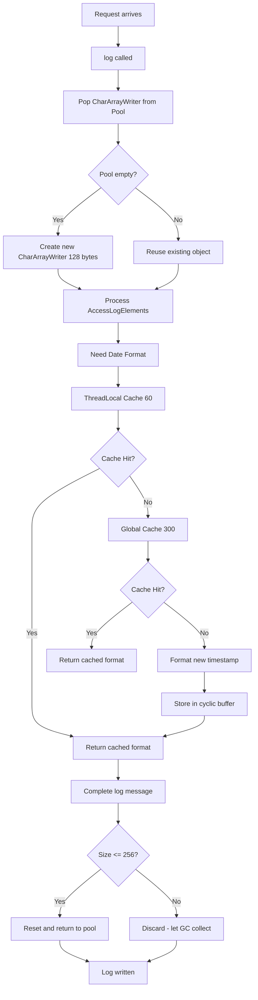
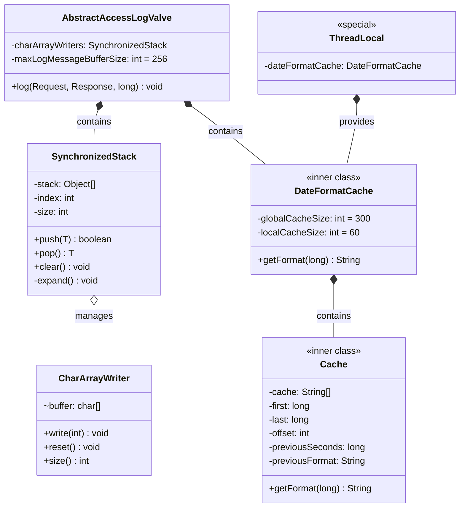
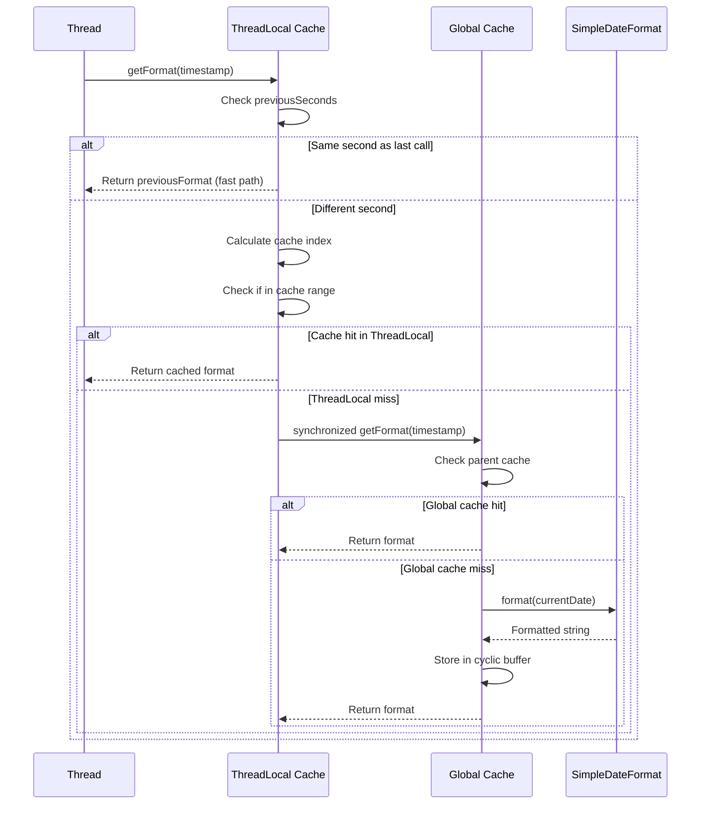
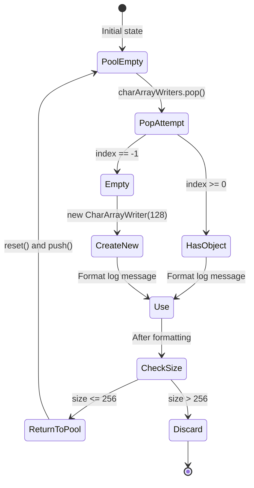
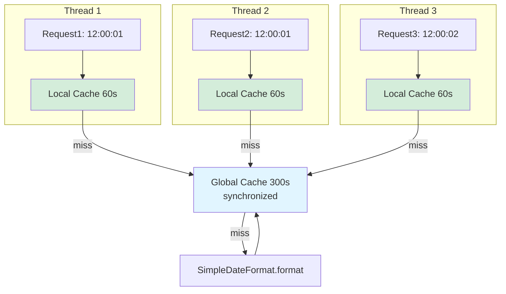
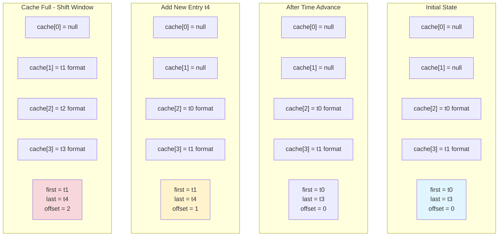
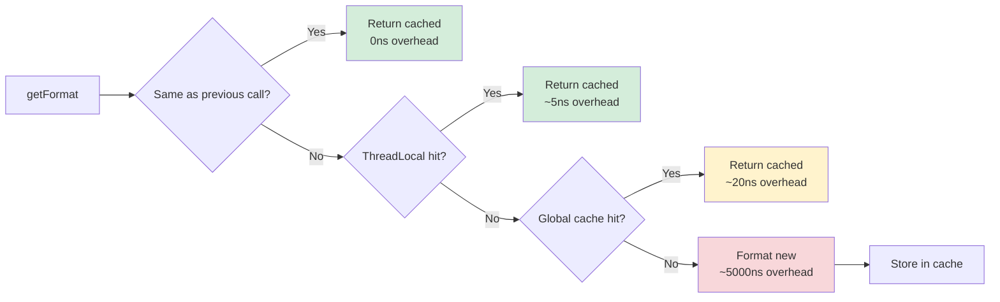
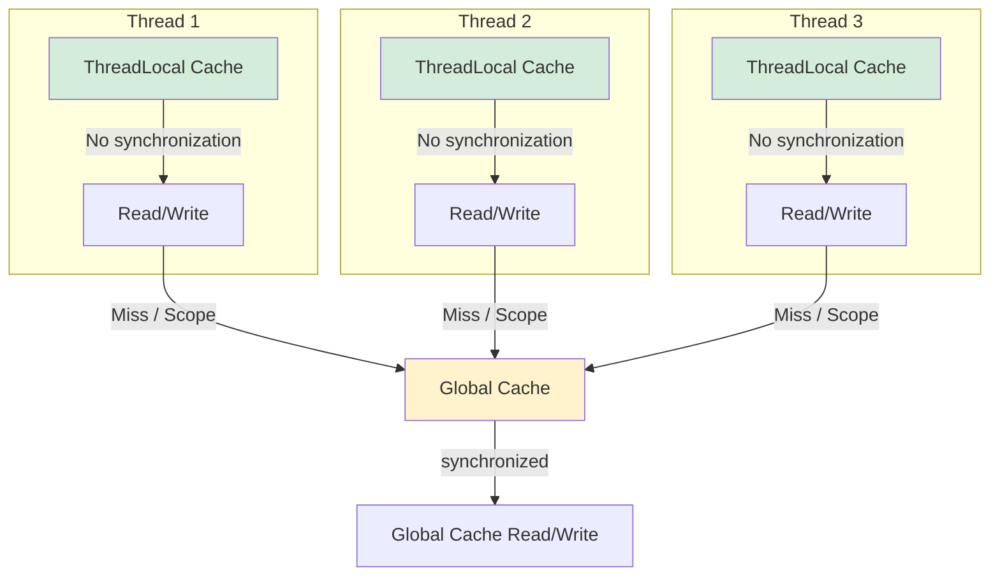

# Tomcat 访问日志缓存机制分析

## Overview

Tomcat 访问日志使用了两层缓存策略来优化性能：**DateFormatCache** 用于缓存日期格式化结果，**CharArrayWriter 对象池** 用于减少字符串拼接时的内存分配。这两种机制显著降低了 GC 压力和日志记录的开销。

## Key Concepts

- **双层日期缓存** - 线程本地缓存(60条) + 全局同步缓存(300条)
- **循环缓冲区** - 基于时间戳的环形缓存结构
- **对象池模式** - CharArrayWriter 复用以减少对象创建
- **无锁设计** - 使用 ThreadLocal 实现线程本地缓存的无锁访问
- **自动扩容** - SynchronizedStack 支持按需扩容

## Visual Overview



## 架构概览



## 如何工作

### 缓存层次结构



### 1. CharArrayWriter 对象池

**实现位置**: `AbstractAccessLogValve.java:455`

```java
private final SynchronizedStack<CharArrayWriter> charArrayWriters = new SynchronizedStack<>();
private int maxLogMessageBufferSize = 256;
```

**工作流程**:



**关键代码**:
```java
@Override
public void log(Request request, Response response, long time) {
    // 1. 从对象池获取
    CharArrayWriter result = charArrayWriters.pop();
    if (result == null) {
        result = new CharArrayWriter(128);
    }

    // 2. 使用对象格式化日志
    for (AccessLogElement logElement : logElements) {
        logElement.addElement(result, request, response, time);
    }

    log(result);

    // 3. 如果大小合理则回收，否则丢弃
    if (result.size() <= maxLogMessageBufferSize) {
        result.reset();
        charArrayWriters.push(result);
    }
}
```

**设计优势**:
- **减少 GC** - 大部分日志消息(通常 < 256 字符)的对象被复用
- **线程安全** - SynchronizedStack 提供同步访问
- **自动扩容** - 当池耗尽时自动扩展，默认 128 → 256 → 512...

### 2. SynchronizedStack 实现

**核心特性**:
- **GC 最小化** - 只在扩容时创建新数组，对象被复用
- **无收缩** - 栈永不收缩，避免不必要的数组复制
- **动态扩容** - 支持按需扩容，可设置上限

```mermaid
flowchart TD
    A[push obj] --> B{index == size?}
    B -->|Yes| C{limit == -1 or size < limit?}
    B -->|No| D[Store at stack[++index]]
    C -->|Yes| E[expand: size * 2]
    C -->|No| F[index--, return false]
    E --> D
    D --> G[return true]

    H[pop] --> I{index == -1?}
    I -->|Yes| J[return null]
    I -->|No--> K[result = stack[index]]
    K --> L[stack[index--] = null]
    L --> M[return result]

    style E fill:#f8d7da
    style J fill:#fff3cd
```

**扩容策略**:
```java
private void expand() {
    int newSize = size * 2;
    if (limit != -1 && newSize > limit) {
        newSize = limit;
    }
    Object[] newStack = new Object[newSize];
    System.arraycopy(stack, 0, newStack, 0, size);
    stack = newStack;
    size = newSize;
}
```

### 3. DateFormatCache - 双层缓存机制

**缓存配置**:
```java
private static final int globalCacheSize = 300;  // 全局缓存
private static final int localCacheSize = 60;     // 线程本地缓存
```



**工作原理**:

1. **快速路径** - 如果是同一秒的重复调用，直接返回上次结果
2. **本地缓存** - 线程本地 60 秒缓存，无锁访问
3. **全局缓存** - 300 秒同步缓存，跨线程共享

```mermaid
flowchart TD
    A[getFormat timestamp] --> B{Check previousSeconds}
    B -->|Same second| C[Return previousFormat]
    B -->|Different| D[Calculate index]

    D --> E{Check cache range}
    E -->|In range| F{cache[index] != null?}
    E -->|Out of range| G[Reset cache window]

    F -->|Found| H[Return cache value]
    F -->|Null| I[Generate new format]

    G --> J[Set first/last bounds]
    J --> I

    I --> K{Has parent cache?}
    K -->|Yes| L[Get from parent synchronized]
    K -->|No| M[SimpleDateFormat.format]

    L --> H
    M --> N[Store in cache[index]]
    N --> H

    style C fill:#d4edda
    style H fill:#d4edda
    style L fill:#fff3cd
```

### 4. 循环缓冲区 (Cyclic Buffer)

**核心概念**:
- 缓存存储**连续时间范围**的格式化结果
- 使用循环索引实现环形缓冲
- 时间戳超出范围时自动滑动窗口



**索引计算**:
```java
int index = (offset + (int) (seconds - first)) % cacheSize;
```

**窗口滑动逻辑**:
```java
// 向前扩展 (时间增加)
if (seconds > last) {
    // 清空将过期的条目
    for (int i = 1; i < seconds - last; i++) {
        cache[(index + cacheSize - i) % cacheSize] = null;
    }
    first = seconds - (cacheSize - 1);
    last = seconds;
    offset = (index + 1) % cacheSize;
}

// 向后扩展 (时间减少)
else {
    for (int i = 1; i < first - seconds; i++) {
        cache[(index + i) % cacheSize] = null;
    }
    first = seconds;
    last = seconds + (cacheSize - 1);
    offset = index;
}
```

## 性能优化要点

### 1. 日期格式化优化

**问题**: `SimpleDateFormat.format()` 是昂贵的操作，每次调用都创建新字符串

**解决方案**: 三层查找机制



### 2. 对象池大小调优

| 参数 | 默认值 | 说明 |
|------|--------|------|
| `globalCacheSize` | 300 | 全局缓存条目数，覆盖 5 分钟 (300秒) |
| `localCacheSize` | 60 | 线程本地缓存条目数，覆盖 1 分钟 (60秒) |
| `maxLogMessageBufferSize` | 256 | 缓冲区回收阈值，字符数 |

**调优建议**:
- 高并发场景：增大 `localCacheSize` 到 120-300
- 长日志消息：增大 `maxLogMessageBufferSize`
- 低并发场景：保持默认值

### 3. 内存与 GC 权衡

```mermaid
flowchart TD
    subgraph "Small Cache (more formatting)"
        S1[More cache misses] --> S2[More SimpleDateFormat.format calls]
        S2 --> S3[Higher CPU usage]
        S3 --> S4[More string objects created]
        S4 --> S5[More GC pressure]
    end

    subgraph "Large Cache (less formatting)"
        L1[Fewer cache misses] --> L2[Fewer SimpleDateFormat.format calls]
        L2 --> L3[Lower CPU usage]
        L3 --> L4[Fewer string objects created]
        L4 --> L5[Less GC pressure]
        L5 --> L6[More memory used]
    end

    style S1 fill:#f8d7da
    style L1 fill:#d4edda
    style S5 fill:#f8d7da
    style L6 fill:#f8d7da
```



## 关键要点

### 性能收益

1. **DateFormatCache**
   - 缓存命中避免昂贵的 `SimpleDateFormat.format()` 调用
   - 本地缓存无锁访问，几乎零开销
   - 全局缓存跨线程共享，提高命中率
   - 典型场景下缓存命中率 > 95%

2. **CharArrayWriter 对象池**
   - 避免频繁创建/销毁缓冲区对象
   - 减少内存分配和 GC 压力
   - 自动处理大消息(丢弃而非回收)

3. **双层设计**
   - 线程本地缓存提供快速无锁访问
   - 全局缓存提供跨线程共享和更大的覆盖范围

### 线程安全



- **ThreadLocal 缓存** - 每个线程独立，无竞争
- **全局缓存** - synchronized 保护，跨线程共享
- **SynchronizedStack** - synchronized 方法，线程安全

### 使用建议

1. **保持默认值** - 对于大多数场景，默认值已经优化良好
2. **监控缓存命中率** - 调整缓存大小时监控性能变化
3. **避免频繁的格式变更** - 不同格式需要独立的缓存实例
4. **注意时区设置** - 所有缓存使用 `TimeZone.getDefault()`
