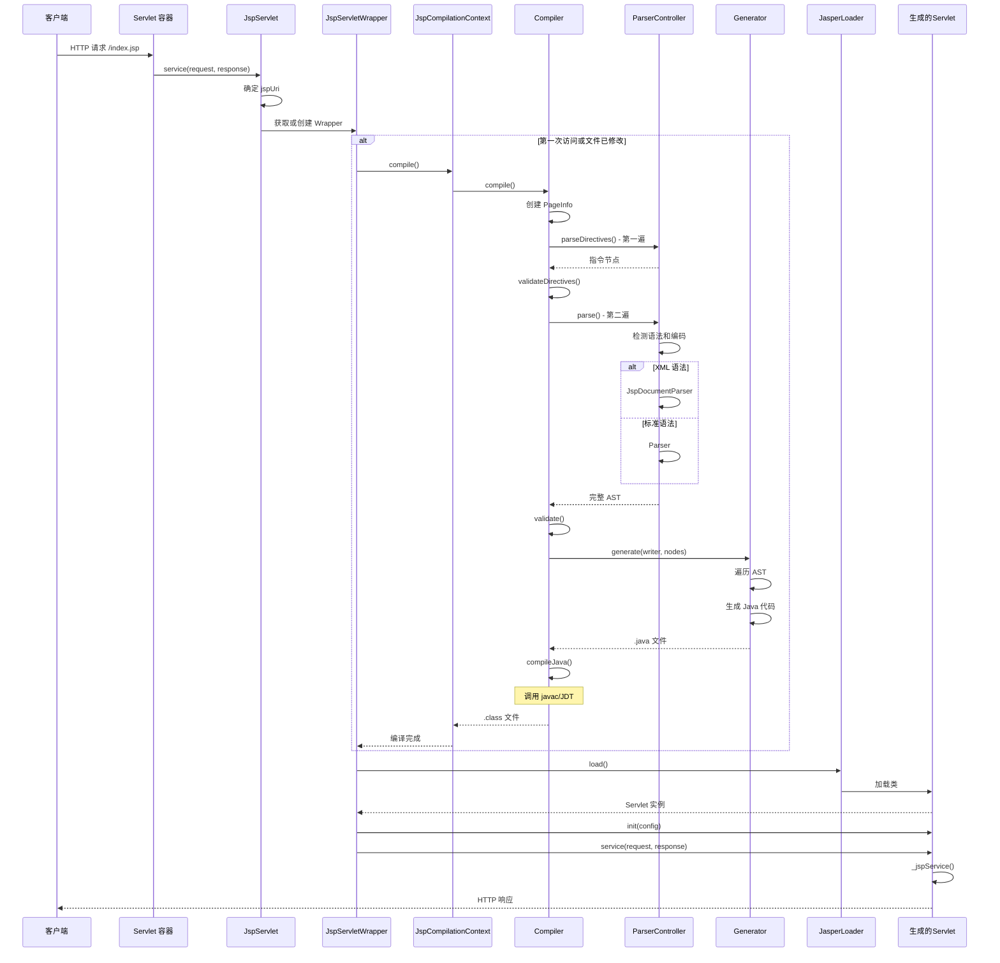

# Tomcat JSP 处理过程架构

## 概述

Jasper 是 Tomcat 的 JSP (JavaServer Pages) 引擎，负责将 JSP 文件翻译、编译为 Java Servlet 并执行。Jasper 实现了 Jakarta JSP 规范，是 Tomcat 处理动态页面内容的核心组件。

**主要功能：**
- JSP 文件解析（标准语法和 XML 语法）
- 生成等效的 Java Servlet 源代码
- 编译生成的 Servlet 类
- 运行时管理和重载
- 标签库 (Tag Library) 支持
- EL (Expression Language) 解析和执行

---

## 模块结构

```
java/org/apache/jasper/
├── servlet/              # Servlet 层集成
│   ├── JspServlet.java              # JSP 入口 Servlet
│   ├── JspServletWrapper.java       # 单个 JSP 的包装器
│   ├── JasperInitializer.java       # 容器初始化器
│   └── JasperLoader.java            # JSP 专用类加载器
│
├── compiler/             # 编译器核心
│   ├── Compiler.java                # 编译器抽象基类
│   ├── ParserController.java        # 解析控制器
│   ├── Parser.java                  # 标准语法解析器
│   ├── JspDocumentParser.java       # XML 语法解析器
│   ├── Generator.java               # Java 代码生成器
│   ├── Validator.java               # JSP 语义验证器
│   ├── Node.java                    # AST 节点定义
│   ├── PageInfo.java                # 页面信息收集
│   └── JspRuntimeContext.java       # 运行时上下文
│
└── runtime/              # 运行时支持
    ├── HttpJspBase.java             # 生成 Servlet 的基类
    ├── PageContextImpl.java         # PageContext 实现
    ├── JspRuntimeLibrary.java       # 运行时工具库
    └── JspFactoryImpl.java          # JspFactory 实现
```

---

## 核心组件

### 1. JspServlet - JSP 入口点

**位置：** `java/org/apache/jasper/servlet/JspServlet.java`

**职责：**
- 作为所有 JSP 请求的入口点 Servlet
- 管理 `JspRuntimeContext`（运行时上下文）
- 创建和缓存 `JspServletWrapper` 实例
- 处理 JSP 预编译请求

**初始化流程：**
```java
// JspServlet.java:66-117
public void init(ServletConfig config) throws ServletException {
    // 1. 创建 Options 配置
    options = new EmbeddedServletOptions(config, context);

    // 2. 初始化 JSP 运行时上下文
    rctxt = new JspRuntimeContext(context, options);

    // 3. 如果指定了 jspFile，预编译
    if (config.getInitParameter("jspFile") != null) {
        serviceJspFile(null, null, jspFile, true);
    }
}
```

**请求处理流程：**
```java
// JspServlet.java:238-289
public void service(HttpServletRequest request, HttpServletResponse response) {
    // 1. 确定 JSP URI
    String jspUri = determineJspUri(request);

    // 2. 检查是否为预编译请求
    boolean precompile = preCompile(request);

    // 3. 委托给 JspServletWrapper 处理
    serviceJspFile(request, response, jspUri, precompile);
}
```

---

### 2. JspServletWrapper - JSP 包装器

**位置：** `java/org/apache/jasper/servlet/JspServletWrapper.java`

**职责：**
- 包装单个 JSP 页面的生命周期
- 管理编译和加载逻辑
- 处理 JSP 重载检测
- 管理生成的 Servlet 实例

**核心状态变量：**
```java
// JspServletWrapper.java:68-94
private volatile Servlet theServlet;      // 生成的 Servlet 实例
private volatile Class<?> tagHandlerClass; // 标签处理器类
private volatile boolean mustCompile;     // 是否需要编译
private volatile boolean reload;          // 是否需要重载
private long available;                   // 服务可用时间
private long lastUsageTime;               // 最后使用时间
```

**服务请求流程：**
```java
// JspServletWrapper.java:338-460
public void service(HttpServletRequest request, HttpServletResponse response, boolean precompile) {

    // (1) 编译检查（开发模式或必须编译时）
    if (options.getDevelopment() || mustCompile) {
        synchronized (this) {
            ctxt.compile();  // 触发编译流程
            mustCompile = false;
        }
    }

    // (2) 加载 Servlet 类
    servlet = getServlet();  // 使用 DCL 加载生成的 Servlet

    // (3) 处理 JSP 卸载限制
    if (unloadAllowed) {
        // 更新 LRU 队列
        ctxt.getRuntimeContext().push(this);
    }

    // (4) 执行 Servlet.service()
    servlet.service(request, response);
}
```

---

### 3. JspCompilationContext - 编译上下文

**位置：** `java/org/apache/jasper/JspCompilationContext.java`

**职责：**
- 管理单个 JSP 的编译过程
- 维护类加载器（`JasperLoader`）
- 生成输出目录结构
- 跟踪依赖关系

**关键方法：**
```java
// 编译 JSP
public void compile() throws JasperException {
    compiler.compile();
}

// 加载编译后的类
public Class<?> load() throws JasperException;

// 获取 Java 文件名
public String getServletJavaFileName();

// 获取 Servlet 类名
public String getServletClassName();
```

---

### 4. Compiler - 编译器

**位置：** `java/org/apache/jasper/compiler/Compiler.java`

**职责：**
- 协调整个编译流程
- 管理 PageInfo（页面信息）
- 调用解析器、验证器、代码生成器

**编译流程：**
```java
// Compiler.java:102-200
protected Map<String,SmapStratum> generateJava() throws Exception {

    // 1. 创建 PageInfo
    pageInfo = new PageInfo(new BeanRepository(...), ctxt);

    // 2. 应用 JSP 配置
    JspConfig.JspProperty jspProperty = jspConfig.findJspProperty(ctxt.getJspFile());
    pageInfo.setELIgnored(...);
    pageInfo.setScriptingInvalid(...);
    // ... 更多配置

    // 3. 创建解析器控制器
    ParserController parserCtl = new ParserController(ctxt, this);

    // 4. 第一遍：解析指令（确定 isELIgnored 等设置）
    Node.Nodes directives = parserCtl.parseDirectives(ctxt.getJspFile());
    Validator.validateDirectives(this, directives);

    // 5. 第二遍：解析完整翻译单元
    pageNodes = parserCtl.parse(ctxt.getJspFile());

    // 6. 验证
    Validator.validate(this, pageNodes);

    // 7. 生成 Java 代码
    try (ServletWriter writer = setupContextWriter(javaFileName)) {
        Generator.generate(writer, this, pageNodes);
    }

    return smaps;
}
```

---

### 5. ParserController - 解析控制器

**位置：** `java/org/apache/jasper/compiler/ParserController.java`

**职责：**
- 选择合适的解析器（标准语法 vs XML 语法）
- 检测文件编码
- 处理静态包含指令

**语法和编码检测流程：**
```java
// ParserController.java:269-386
private void determineSyntaxAndEncoding(String absFileName, Jar jar, String jspConfigPageEnc) {

    // 1. 检查文件扩展名或 JSP 配置
    if (absFileName.endsWith(".jspx") || absFileName.endsWith(".tagx")) {
        isXml = true;
    }

    // 2. 对于 XML 或未知语法，检测编码
    if (!isXml) {
        EncodingDetector encodingDetector = new EncodingDetector(bis);
        sourceEnc = encodingDetector.getEncoding();
        isEncodingSpecifiedInProlog = encodingDetector.isEncodingSpecifiedInProlog();
        isBomPresent = (encodingDetector.getSkip() > 0);
    }

    // 3. 搜索 <jsp:root> 元素确定语法
    if (!isExternal && hasJspRoot(jspReader)) {
        isXml = true;
    }

    // 4. 对于标准语法，从 page 指令获取编码
    if (!isXml && !isBomPresent) {
        sourceEnc = getPageEncodingForJspSyntax(jspReader, startMark);
    }
}
```

**解析器选择：**
```java
// ParserController.java:229-243
if (isXml) {
    // XML 语法 - 使用 JspDocumentParser
    parsedPage = JspDocumentParser.parse(this, absFileName, jar, parent,
        isTagFile, directiveOnly, sourceEnc, jspConfigPageEnc,
        isEncodingSpecifiedInProlog, isBomPresent);
} else {
    // 标准语法 - 使用 Parser
    JspReader jspReader = new JspReader(ctxt, absFileName, inStreamReader, err);
    parsedPage = Parser.parse(this, jspReader, parent, isTagFile,
        directiveOnly, jar, sourceEnc, jspConfigPageEnc,
        isDefaultPageEncoding, isBomPresent);
}
```

---

### 6. Parser - 标准语法解析器

**位置：** `java/org/apache/jasper/compiler/Parser.java`

**职责：**
- 解析标准 JSP 语法（`<% ... %>`）
- 构建抽象语法树 (AST)
- 识别各种 JSP 元素：
  - 模板文本
  - 脚本片段 (`<% ... %>`、`<%= ... %>`、`<%! ... %>`)
  - 指令 (`<%@ ... %>`)
  - 动作 (`<jsp:...>`)
  - EL 表达式

**解析示例：**
```jsp
<%@ page contentType="text/html" %>
<html>
<body>
    <p>Hello, <%= name %>!</p>
    <jsp:include page="header.jsp" />
</body>
</html>
```

**生成的 AST 结构（简化）：**
```
Node.Nodes (Root)
├── Node.PageDirective
├── Node.TemplateText ("<html>\n<body>\n    <p>")
├── Node.ELExpression ("name")
├── Node.TemplateText ("!</p>\n    ")
└── Node.IncludeAction
```

---

### 7. Generator - 代码生成器

**位置：** `java/org/apache/jasper/compiler/Generator.java`

**职责：**
- 遍历 AST 节点
- 生成 Java Servlet 源代码
- 生成 SMAP (Source Map) 用于调试

**生成的 Servlet 结构：**
```java
// 由 Generator 生成
public final class example_0002ejsp extends HttpJspBase {

    // 静态初始化
    static { ... }

    // _jspInit 方法
    public void _jspInit() { ... }

    // _jspDestroy 方法
    public void _jspDestroy() { ... }

    // _jspService 方法（核心）
    public void _jspService(HttpServletRequest request, HttpServletResponse response)
            throws ServletException, IOException {

        // 页面上下文设置
        PageContext pageContext = null;
        HttpSession session = null;
        ServletContext application = null;
        ServletConfig config = null;

        try {
            // 初始化页面上下文
            pageContext = _jspxFactory.getPageContext(...);
            application = pageContext.getServletContext();
            config = pageContext.getServletConfig();
            session = pageContext.getSession();
            out = pageContext.getOut();

            // 页面内容生成
            out.write("<html>\n<body>\n    <p>Hello, ");
            out.print(org.apache.jasper.runtime.PageContextImpl.proprietaryEvaluate(
                "${name}", String.class, pageContext, null));
            out.write("!</p>\n</body>\n</html>");

        } catch (Throwable t) {
            // 错误处理
        } finally {
            _jspxFactory.releasePageContext(pageContext);
        }
    }
}
```

---

### 8. HttpJspBase - 生成的 Servlet 基类

**位置：** `java/org/apache/jasper/runtime/HttpJspBase.java`

**职责：**
- 作为所有 JSP 生成 Servlet 的父类
- 实现 `HttpJspPage` 接口
- 提供生命周期钩子

**类定义：**
```java
// HttpJspBase.java:35-84
public abstract class HttpJspBase extends HttpServlet implements HttpJspPage {

    @Override
    public final void init(ServletConfig config) throws ServletException {
        super.init(config);
        jspInit();      // 用户可覆盖
        _jspInit();     // JSP 生成代码
    }

    @Override
    public final void service(HttpServletRequest request, HttpServletResponse response)
            throws ServletException, IOException {
        _jspService(request, response);  // 委托给生成的 _jspService
    }

    @Override
    public final void destroy() {
        jspDestroy();   // 用户可覆盖
        _jspDestroy();  // JSP 生成代码
    }

    // 抽象方法，由子类实现
    @Override
    public abstract void _jspService(HttpServletRequest request, HttpServletResponse response)
            throws ServletException, IOException;
}
```

---

## JSP 处理完整流程



---

## 关键工作流详解

### 1. JSP 编译工作流

```
┌─────────────────────────────────────────────────────────────────────┐
│                        JSP 编译流程                                  │
├─────────────────────────────────────────────────────────────────────┤
│                                                                     │
│  JSP 文件                                                           │
│     │                                                               │
│     ▼                                                               │
│  ┌───────────────────────────────────────┐                          │
│  │  ParserController.doParse()           │                          │
│  │  - 检测文件语法 (标准/XML)             │                          │
│  │  - 检测编码                           │                          │
│  │  - 选择合适的解析器                    │                          │
│  └───────────────────────────────────────┘                          │
│     │                                                               │
│     ▼                                                               │
│  ┌───────────────────────────────────────┐                          │
│  │  Parser.parse() /                     │                          │
│  │  JspDocumentParser.parse()            │                          │
│  │  - 构建 AST 节点树                     │                          │
│  │  - 处理指令、动作、EL 表达式            │                          │
│  └───────────────────────────────────────┘                          │
│     │                                                               │
│     ▼                                                               │
│  ┌───────────────────────────────────────┐                          │
│  │  Validator.validate()                 │                          │
│  │  - 语义验证                           │                          │
│  │  - 检查标签库依赖                     │                          │
│  │  - 脚本变量检查                        │                          │
│  └───────────────────────────────────────┘                          │
│     │                                                               │
│     ▼                                                               │
│  ┌───────────────────────────────────────┐                          │
│  │  Generator.generate()                 │                          │
│  │  - 遍历 AST 节点                       │                          │
│  │  - 生成 Java 源代码                    │                          │
│  │  - 生成 SMAP (调试支持)                │                          │
│  └───────────────────────────────────────┘                          │
│     │                                                               │
│     ▼                                                               │
│  ┌───────────────────────────────────────┐                          │
│  │  Java Compiler (javac/JDT)            │                          │
│  │  - 编译 .java → .class                 │                          │
│  └───────────────────────────────────────┘                          │
│     │                                                               │
│     ▼                                                               │
│  Servlet 类文件                                                      │
│                                                                     │
└─────────────────────────────────────────────────────────────────────┘
```

### 2. JSP 重载检测

```java
// JspServletWrapper.java:139-183
private boolean getReloadInternal() {
    return reload && !ctxt.getRuntimeContext().isCompileCheckInProgress();
}

public Servlet getServlet() throws ServletException {
    // 双重检查锁定 (DCL) 模式
    if (getReloadInternal() || theServlet == null) {
        synchronized (this) {
            if (getReloadInternal() || theServlet == null) {
                destroy();  // 销毁旧的 Servlet 实例

                // 使用 InstanceManager 创建新实例
                InstanceManager instanceManager = InstanceManagerFactory.getInstanceManager(config);
                servlet = (Servlet) instanceManager.newInstance(ctxt.getFQCN(), ctxt.getJspLoader());

                servlet.init(config);

                if (theServlet != null) {
                    ctxt.getRuntimeContext().incrementJspReloadCount();
                }

                theServlet = servlet;
                reload = false;
            }
        }
    }
    return theServlet;
}
```

**重载触发条件：**
1. 开发模式 (`development=true`)：每次请求都检查
2. 生产模式：定期检查 (`checkInterval` 配置)
3. JSP 文件修改时间戳变化
4. 依赖文件（如 include 的文件）修改

### 3. 标签文件处理

**标签文件类型：**
1. **标签库描述符 (TLD)** - XML 格式的标签库定义
2. **标签文件 (.tag)** - JSP 格式的标签实现

**处理流程：**
```
.tag 文件
    │
    ▼
ParserController (识别为标签文件)
    │
    ▼
TagFileProcessor
    │
    ▼
生成标签处理器类 (extends SimpleTagSupport/TagSupport)
    │
    ▼
编译并加载
    │
    ▼
在 JSP 中实例化使用
```

---

## 依赖关系

### Jasper 内部依赖

```
┌─────────────────────────────────────────────────────────────────┐
│                      Jasper 依赖图                               │
├─────────────────────────────────────────────────────────────────┤
│                                                                 │
│  JspServlet                                                    │
│      │                                                          │
│      ├──→ JspRuntimeContext (运行时管理)                         │
│      │         │                                                │
│      │         ├──→ JspServletWrapper (每个 JSP 一个)            │
│      │         │         │                                      │
│      │         │         ├──→ JspCompilationContext              │
│      │         │         │         │                            │
│      │         │         │         ├──→ Compiler                 │
│      │         │         │         │         │                  │
│      │         │         │         │         ├──→ ParserController│
│      │         │         │         │         │         │        │
│      │         │         │         │         │         ├──→ Parser│
│      │         │         │         │         │         └──→ JspDocumentParser
│      │         │         │         │         │                  │
│      │         │         │         │         ├──→ Validator      │
│      │         │         │         │         │                  │
│      │         │         │         │         └──→ Generator       │
│      │         │         │         │                  │         │
│      │         │         │         └──→ JasperLoader   │         │
│      │         │         │                            │         │
│      │         │         └──→ HttpJspBase (生成的 Servlet 基类)  │
│      │         │                                              │
│      │         └──→ TldCache (TLD 缓存)                          │
│      │                                                        │
│      └──→ EmbeddedServletOptions (配置)                         │
│                                                                 │
└─────────────────────────────────────────────────────────────────┘
```

### 外部依赖

| 依赖 | 用途 |
|------|------|
| Servlet API | javax.servlet/jakarta.servlet 包 |
| JSP API | javax.servlet.jsp/jakarta.servlet.jsp 包 |
| EL API | javax.el/jakarta.el 包 |
| JDT Compiler | Eclipse JDT 编译器 (默认 Java 编译器) |
| Ant | 备选编译器 (AntCompiler) |
| XML 处理 | JSP 文档解析 |

---

## 集成点

### 1. 与 Servlet 容器集成

**初始化：**
```java
// JasperInitializer.java
public void onStartup(Set<Class<?>> c, ServletContext ctx) throws ServletException {
    // 注册 JspServlet
    ServletRegistration.Dynamic jsp = ctx.addServlet("jsp", JspServlet.class);
    jsp.addMapping("*.jsp", "*.jspx");

    // 设置初始化参数
    jsp.setInitParameter("fork", "false");
    jsp.setInitParameter("xpoweredBy", "false");
}
```

**请求映射：**
- `*.jsp` - 标准 JSP 页面
- `*.jspx` - XML 语法的 JSP 文档

### 2. 类加载集成

```
WebAppClassLoader (Web 应用类加载器)
    │
    ├──→ JasperLoader (JSP 专用加载器)
    │         │
    │         └──→ 生成的 Servlet 类
    │
    └──→ 其他 Web 应用类
```

**JasperLoader 特点：**
- 单独的类加载空间，避免类冲突
- 支持热重载（重新加载修改后的 JSP）
- 委托给 WebAppClassLoader 加载 Web 应用类

### 3. 配置集成

**配置来源优先级：**
1. `web.xml` 中的 `<jsp-config>` 元素
2. JSP 页面指令 (`<%@ page %>`)
3. 全局 JSP 配置 (`conf/web.xml`)
4. Jasper 默认值

---

## 代码示例

### 示例 1: 简单 JSP 页面转换

**输入 JSP (`hello.jsp`)：**
```jsp
<%@ page contentType="text/html;charset=UTF-8" %>
<%@ page import="java.util.Date" %>
<!DOCTYPE html>
<html>
<head><title>Hello</title></head>
<body>
    <h1>Hello, <%= request.getParameter("name") %>!</h1>
    <p>Time: <%= new Date() %></p>
    <p>Count: ${sessionScope.count}</p>
</body>
</html>
```

**生成的 Java 代码（简化）：**
```java
package org.apache.jsp;

import javax.servlet.http.*;
import javax.servlet.*;
import java.util.Date;

public final class hello_jsp extends HttpJspBase {

    private static final javax.servlet.jsp.JspFactory _jspxFactory =
        javax.servlet.jsp.JspFactory.getDefaultFactory();

    @Override
    public void _jspService(HttpServletRequest request,
                           HttpServletResponse response)
            throws ServletException, IOException {

        PageContext pageContext = null;
        HttpSession session = null;
        ServletContext application = null;
        JspWriter out = null;

        try {
            response.setContentType("text/html;charset=UTF-8");
            pageContext = _jspxFactory.getPageContext(
                this, request, response, null, true, 8192, true);
            session = pageContext.getSession();
            application = pageContext.getServletContext();
            out = pageContext.getOut();

            out.write("<!DOCTYPE html>\n<html>\n<head><title>Hello</title></head>\n<body>\n");
            out.write("    <h1>Hello, ");
            out.print(request.getParameter("name"));
            out.write("!</h1>\n");
            out.write("    <p>Time: ");
            out.print(new Date());
            out.write("</p>\n");
            out.write("    <p>Count: ");
            out.print(org.apache.jasper.runtime.PageContextImpl.proprietaryEvaluate(
                "${sessionScope.count}",
                Object.class,
                pageContext,
                null));
            out.write("</p>\n</body>\n</html>");

        } catch (Throwable t) {
            if (!(t instanceof javax.servlet.jsp.SkipPageException)) {
                out = _jspxFactory.getJspContext(pageContext).getOut();
                if (out != null && out.getBufferSize() != 0)
                    try {
                        out.clearBuffer();
                    } catch (java.io.IOException e) {}
                if (pageContext != null)
                    pageContext.handlePageException(t);
            }
        } finally {
            _jspxFactory.releasePageContext(pageContext);
        }
    }
}
```

### 示例 2: 自定义标签处理

**标签文件 (`functions.tag`)：**
```jsp
<%@ tag description="Custom utility functions" pageEncoding="UTF-8" %>
<%@ attribute name="input" required="true" rtexprvalue="true" %>
<%@ variable name-given="result" scope="AT_END" %>
<%
    String processed = input.toUpperCase();
    jspContext.setAttribute("result", processed);
%>
```

**使用标签的 JSP：**
```jsp
<%@ taglib tagdir="/WEB-INF/tags" prefix="my" %>
<my:functions input="${userInput}" />
Result: ${result}
```

---

## 性能考虑

### 1. 编译优化

- **两遍解析**：先解析指令确定 `isELIgnored`，再完整解析
- **编译缓存**：已编译的 JSP 被缓存为 Servlet 实例
- **按需编译**：首次访问时才编译
- **JSP 预编译**：启动时预编译关键页面

### 2. 运行时优化

- **标签池化**：可配置的标签处理器池 (`TagHandlerPool`)
- **文本优化**：连续的文本节点合并
- **EL 缓存**：EL 表达式解析结果缓存
- **JSP 卸载**：内存压力时卸载不常用的 JSP

### 3. 配置建议

```xml
<servlet>
    <servlet-name>jsp</servlet-name>
    <servlet-class>org.apache.jasper.servlet.JspServlet</servlet-class>
    <init-param>
        <param-name>development</param-name>
        <param-value>false</param-value> <!-- 生产环境设为 false -->
    </init-param>
    <init-param>
        <param-name>checkInterval</param-name>
        <param-value>300</param-value> <!-- 5 分钟检查一次修改 -->
    </init-param>
    <init-param>
        <param-name>modificationTestInterval</param-name>
        <param-value>0</param-value> <!-- 0 = 每次检查，>0 = 缓存修改时间 -->
    </init-param>
    <init-param>
        <param-name>poolingEnabled</param-name>
        <param-value>true</param-value> <!-- 启用标签池 -->
    </init-param>
</servlet>
```

---

## 调试支持

### SMAP (Source Map)

SMAP 是 JSR-045 规范定义的源码映射机制，允许调试器将编译后的 Java 代码映射回原始 JSP 源码。

```java
// 生成 SMAP
Generator.generate(writer, this, pageNodes);

// SMAP 包含的信息：
// - JSP 文件名
// - Java 文件名
// - 行号映射
```

### 开发模式

```xml
<init-param>
    <param-name>development</param-name>
    <param-value>true</param-value>
</init-param>
<init-param>
    <param-name>displaySourceFragment</param-name>
    <param-value>true</param-value>
</init-param>
```

开发模式下：
- 每次请求检查 JSP 修改
- 错误信息包含源码片段
- 详细的异常堆栈跟踪

---

## 安全考虑

### 1. 输入验证

- EL 表达式注入防护
- 脚本片段沙箱
- 标签库白名单

### 2. 资源限制

```xml
<init-param>
    <param-name>maxLoadedJsps</param-name>
    <param-value>500</param-value> <!-- 最大加载 JSP 数量 -->
</init-param>
<init-param>
    <param-name>jspIdleTimeout</param-name>
    <param-value>600</param-value> <!-- JSP 空闲超时（秒） -->
</init-param>
```

### 3. 文件访问控制

- 限制 JSP 只能访问 WEB-INF 下的资源
- 标签文件包含路径验证

---

## 参考资料

- **JSP 规范**: Jakarta JSP 3.1 Specification
- **关键源文件**:
  - `JspServlet.java:48-360` - JSP 入口和请求处理
  - `JspServletWrapper.java:56-582` - JSP 包装和生命周期
  - `Compiler.java:102-200` - 编译流程协调
  - `ParserController.java:96-556` - 解析控制和语法检测
  - `Generator.java:62-150` - 代码生成
  - `HttpJspBase.java:35-84` - 生成 Servlet 基类

---

*文档生成时间: 2025*
*Tomcat 版本: 主分支*
