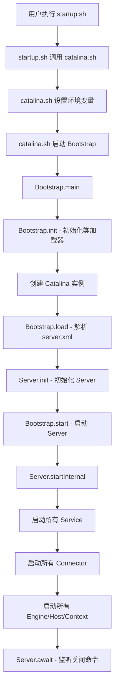
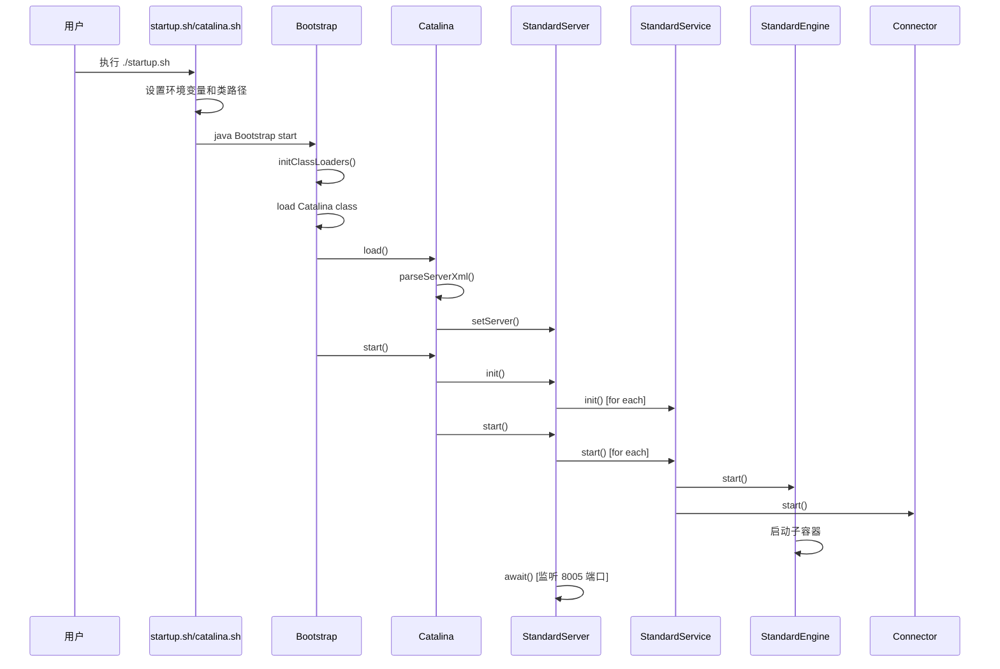

# Apache Tomcat 启动过程架构分析

## 概述

Apache Tomcat 的启动过程是一个精心设计的多阶段流程，从 shell 脚本到 Java 类加载，再到容器组件的初始化和启动。本文档详细分析了 Tomcat 的完整启动架构和流程。

## 启动流程概览



## 1. Shell 脚本层

### 1.1 startup.sh 入口

**文件**: [bin/startup.sh](bin/startup.sh)

`startup.sh` 是用户启动 Tomcat 的入口脚本。它实际上是一个简单的包装器，主要职责是调用 `catalina.sh`:

```bash
# startup.sh 核心逻辑
PRGDIR=`dirname "$PRG"`
EXECUTABLE=catalina.sh
exec "$PRGDIR"/"$EXECUTABLE" start "$@"
```

### 1.2 catalina.sh 核心脚本

**文件**: [bin/catalina.sh](bin/catalina.sh)

`catalina.sh` 是真正的启动控制脚本，负责：

1. 设置环境变量（CATALINA_HOME, CATALINA_BASE, JAVA_HOME 等）
2. 设置类路径 (CLASSPATH)
3. 设置 JVM 参数
4. 启动 Bootstrap 类

关键启动命令：
```bash
$_RUNJAVA -Djava.util.logging.manager=org.apache.juli.logging.LogManager \
          -Djava.util.logging.config.file="$LOGGING_CONFIG" \
          $LOGGING_MANAGER $JAVA_OPTS $CATALINA_OPTS \
          -classpath "$CLASSPATH" \
          -Dcatalina.base="$CATALINA_BASE" \
          -Dcatalina.home="$CATALINA_HOME" \
          -Djava.io.tmpdir="$CATALINA_TMPDIR" \
          org.apache.catalina.startup.Bootstrap "$@" start
```

## 2. Java 引导层

### 2.1 Bootstrap 类

**文件**: [java/org/apache/catalina/startup/Bootstrap.java](java/org/apache/catalina/startup/Bootstrap.java)

Bootstrap 是 Tomcat 的 Java 层入口点，主要职责是设置类加载器层次结构。

#### 2.1.1 类加载器层次

Tomcat 使用自定义的类加载器层次来实现类库的隔离：

```
                    Bootstrap ClassLoader
                           (JVM 核心类)
                                |
                    Common ClassLoader
            (catalina.properties 中 common.loader)
                        /           \
        Catalina ClassLoader    Shared ClassLoader
    (catalina.properties 中      (catalina.properties 中
      server.loader)              shared.loader)
           |                        |
    (Tomcat 内部类)              (Web 应用共享类)
```

**关键代码** ([Bootstrap.java:136-150](java/org/apache/catalina/startup/Bootstrap.java#L136-L150)):

```java
private void initClassLoaders() {
    try {
        commonLoader = createClassLoader("common", null);
        if (commonLoader == null) {
            commonLoader = this.getClass().getClassLoader();
        }
        catalinaLoader = createClassLoader("server", commonLoader);
        sharedLoader = createClassLoader("shared", commonLoader);
    } catch (Throwable t) {
        handleThrowable(t);
        log.error("Class loader creation threw exception", t);
        System.exit(1);
    }
}
```

#### 2.1.2 Bootstrap.main() 流程

**文件**: [Bootstrap.java:429-499](java/org/apache/catalina/startup/Bootstrap.java#L429-L499)

```java
public static void main(String[] args) {
    synchronized (daemonLock) {
        if (daemon == null) {
            Bootstrap bootstrap = new Bootstrap();
            try {
                bootstrap.init();  // 初始化类加载器
            } catch (Throwable t) {
                handleThrowable(t);
                log.error("Init exception", t);
                return;
            }
            daemon = bootstrap;
        }
    }

    try {
        String command = "start";
        if (args.length > 0) {
            command = args[args.length - 1];
        }

        switch (command) {
            case "start":
                daemon.setAwait(true);
                daemon.load(args);    // 加载配置
                daemon.start();       // 启动服务器
                break;
            // ... 其他命令
        }
    } catch (Throwable t) {
        log.error("Error running command", throwable);
        System.exit(1);
    }
}
```

#### 2.1.3 Bootstrap.init() 方法

**文件**: [Bootstrap.java:245-271](java/org/apache/catalina/startup/Bootstrap.java#L245-L271)

```java
public void init() throws Exception {
    // 1. 初始化三个类加载器
    initClassLoaders();

    // 2. 设置上下文类加载器
    Thread.currentThread().setContextClassLoader(catalinaLoader);

    // 3. 通过反射加载 Catalina 类
    Class<?> startupClass = catalinaLoader.loadClass("org.apache.catalina.startup.Catalina");
    Object startupInstance = startupClass.getConstructor().newInstance();

    // 4. 设置 Catalina 的父类加载器
    Method method = startupInstance.getClass().getMethod("setParentClassLoader", ClassLoader.class);
    method.invoke(startupInstance, sharedLoader);

    catalinaDaemon = startupInstance;
}
```

## 3. Catalina 启动层

### 3.1 Catalina 类

**文件**: [java/org/apache/catalina/startup/Catalina.java](java/org/apache/catalina/startup/Catalina.java)

Catalina 是 Tomcat 的启动协调器，负责解析配置文件和初始化组件。

#### 3.1.1 Catalina.load() 方法

**文件**: [Catalina.java:679-720](java/org/apache/catalina/startup/Catalina.java#L679-L720)

```java
public void load() {
    if (loaded) {
        return;
    }
    loaded = true;

    // 1. 初始化 JNDI
    initNaming();

    // 2. 解析 server.xml
    parseServerXml(true);
    Server s = getServer();
    if (s == null) {
        return;
    }

    // 3. 设置 Server 的引用
    getServer().setCatalina(this);
    getServer().setCatalinaHome(Bootstrap.getCatalinaHomeFile());
    getServer().setCatalinaBase(Bootstrap.getCatalinaBaseFile());

    // 4. 初始化流重定向
    initStreams();

    // 5. 初始化 Server
    try {
        getServer().init();
    } catch (LifecycleException e) {
        if (throwOnInitFailure) {
            throw new Error(e);
        } else {
            log.error(sm.getString("catalina.initError"), e);
        }
    }
}
```

#### 3.1.2 Digester 配置解析

**文件**: [Catalina.java:383-489](java/org/apache/catalina/startup/Catalina.java#L383-L489)

Catalina 使用 Digester 框架解析 `server.xml` 配置文件。Digester 是一个基于规则的 XML 解析器，可以将 XML 元素映射到 Java 对象。

关键配置规则：

```java
protected Digester createStartDigester() {
    Digester digester = new Digester();
    digester.setValidating(false);

    // Server 元素
    digester.addObjectCreate("Server", "org.apache.catalina.core.StandardServer", "className");
    digester.addSetProperties("Server");
    digester.addSetNext("Server", "setServer", "org.apache.catalina.Server");

    // Service 元素
    digester.addObjectCreate("Server/Service", "org.apache.catalina.core.StandardService", "className");
    digester.addSetProperties("Server/Service");
    digester.addSetNext("Server/Service", "addService", "org.apache.catalina.Service");

    // Connector 元素
    digester.addRule("Server/Service/Connector", new ConnectorCreateRule());
    digester.addSetProperties("Server/Service/Connector");
    digester.addSetNext("Server/Service/Connector", "addConnector", "org.apache.catalina.connector.Connector");

    // Engine/Host/Context 通过 RuleSet 添加
    digester.addRuleSet(new EngineRuleSet("Server/Service/"));
    digester.addRuleSet(new HostRuleSet("Server/Service/Engine/"));
    digester.addRuleSet(new ContextRuleSet("Server/Service/Engine/Host/"));

    return digester;
}
```

#### 3.1.3 Catalina.start() 方法

**文件**: [Catalina.java:741-797](java/org/apache/catalina/startup/Catalina.java#L741-L797)

```java
public void start() {
    if (getServer() == null) {
        load();
    }

    if (getServer() == null) {
        log.fatal(sm.getString("catalina.noServer"));
        return;
    }

    // 1. 启动 Server
    try {
        getServer().start();
    } catch (LifecycleException e) {
        log.fatal(sm.getString("catalina.serverStartFail"), e);
        try {
            getServer().destroy();
        } catch (LifecycleException e1) {
            log.debug(sm.getString("catalina.destroyFail"), e1);
        }
        return;
    }

    // 2. 注册关闭钩子
    if (useShutdownHook) {
        if (shutdownHook == null) {
            shutdownHook = new CatalinaShutdownHook();
        }
        Runtime.getRuntime().addShutdownHook(shutdownHook);
    }

    // 3. 进入等待状态
    if (await) {
        await();   // 等待关闭命令
        stop();
    }
}
```

## 4. Lifecycle 生命周期管理

### 4.1 Lifecycle 接口

**文件**: [java/org/apache/catalina/Lifecycle.java](java/org/apache/catalina/Lifecycle.java)

Tomcat 使用统一的生命周期接口管理所有组件的状态转换。

#### 4.1.1 状态转换图

```
            start()
  -----------------------------
  |                           |
  | init()                    |
NEW ---»--- INITIALIZING        |
| |           |              |     ------------------«-----------------------
| |           |auto          |     |                                        |
| |          \|/    start() \|/   \|/     auto          auto         stop() |
| |      INITIALIZED --»-- STARTING_PREP --»- STARTING --»- STARTED --»---  |
| |         |                                                            |  |
| |destroy()|                                                            |  |
| --»-----«--    ------------------------«--------------------------------  ^
|     |          |                                                          |
|     |         \|/          auto                 auto              start() |
|     |     STOPPING_PREP ----»---- STOPPING ------»----- STOPPED -----»-----
|    \|/                               ^                     |  ^
|     |               stop()           |                     |  |
|     |       --------------------------                     |  |
|     |       |                                              |  |
|     |       |    destroy()                       destroy() |  |
|     |    FAILED ----»------ DESTROYING ---«-----------------  |
|     |                        ^     |                          |
|     |     destroy()          |     |auto                      |
|     --------»-----------------    \|/                         |
|                                 DESTROYED                     |
|                                                               |
|                            stop()                             |
----»-----------------------------»------------------------------
```

#### 4.1.2 生命周期方法

| 方法 | 描述 | 触发事件 |
|------|------|----------|
| `init()` | 初始化组件，执行初始化后操作 | INIT_EVENT |
| `start()` | 启动组件，使其可用 | BEFORE_START_EVENT, START_EVENT, AFTER_START_EVENT |
| `stop()` | 停止组件 | BEFORE_STOP_EVENT, STOP_EVENT, AFTER_STOP_EVENT |
| `destroy()` | 销毁组件，释放资源 | BEFORE_DESTROY_EVENT, AFTER_DESTROY_EVENT |

## 5. Server 层

### 5.1 StandardServer 类

**文件**: [java/org/apache/catalina/core/StandardServer.java](java/org/apache/catalina/core/StandardServer.java)

StandardServer 是 Tomcat 的顶层容器，代表整个 Tomcat 实例。

#### 5.1.1 StandardServer.initInternal()

**文件**: [StandardServer.java:931-953](java/org/apache/catalina/core/StandardServer.java#L931-L953)

```java
@Override
protected void initInternal() throws LifecycleException {
    super.initInternal();

    // 1. 注册全局字符串缓存
    onameStringCache = register(new StringCache(), "type=StringCache");

    // 2. 注册 MBeanFactory (用于 JMX 管理)
    MBeanFactory factory = new MBeanFactory();
    factory.setContainer(this);
    onameMBeanFactory = register(factory, "type=MBeanFactory");

    // 3. 初始化全局命名资源
    globalNamingResources.init();

    // 4. 初始化所有 Service
    for (Service service : findServices()) {
        service.init();
    }
}
```

#### 5.1.2 StandardServer.startInternal()

**文件**: [StandardServer.java:849-871](java/org/apache/catalina/core/StandardServer.java#L849-L871)

```java
@Override
protected void startInternal() throws LifecycleException {
    fireLifecycleEvent(CONFIGURE_START_EVENT, null);
    setState(LifecycleState.STARTING);

    // 1. 初始化工具线程池
    synchronized (utilityExecutorLock) {
        reconfigureUtilityExecutor(getUtilityThreadsInternal(utilityThreads));
        register(utilityExecutor, "type=UtilityExecutor");
    }

    // 2. 启动全局命名资源
    globalNamingResources.start();

    // 3. 启动所有 Service
    for (Service service : findServices()) {
        service.start();
    }

    // 4. 启动周期性生命周期事件
    if (periodicEventDelay > 0) {
        monitorFuture = getUtilityExecutor().scheduleWithFixedDelay(
            this::startPeriodicLifecycleEvent, 0, 60, TimeUnit.SECONDS);
    }
}
```

#### 5.1.3 StandardServer.await() - 关闭监听

**文件**: [StandardServer.java:505-629](java/org/apache/catalina/core/StandardServer.java#L505-L629)

Tomcat 启动完成后会进入 `await()` 方法，监听关闭端口（默认 8005）：

```java
@Override
public void await() {
    // 创建 ServerSocket 监听关闭端口
    awaitSocket = new ServerSocket(getPortWithOffset(), 1,
                                   InetAddress.getByName(address));

    try {
        awaitThread = Thread.currentThread();

        // 循环等待连接和有效命令
        while (!stopAwait) {
            Socket socket = serverSocket.accept();
            socket.setSoTimeout(10 * 1000);
            InputStream stream = socket.getInputStream();

            // 读取字符
            StringBuilder command = new StringBuilder();
            int expected = 1024; // 防止 DoS 攻击
            while (expected > 0) {
                int ch = stream.read();
                if (ch < 32 || ch == 127) break; // 控制字符终止
                command.append((char) ch);
                expected--;
            }

            // 匹配关闭命令
            boolean match = command.toString().equals(shutdown);
            if (match) {
                log.info("StandardServer.shutdownViaPort");
                break;
            }
        }
    } finally {
        serverSocket.close();
    }
}
```

## 6. 容器层次结构

### 6.1 容器组件层次

```
┌─────────────────────────────────────────────────────────────┐
│                         Server                              │
│  (端口: 8005 - 关闭端口)                                     │
└─────────────────────────────────────────────────────────────┘
                              │
                              ▼
┌─────────────────────────────────────────────────────────────┐
│                         Service                             │
│  (命名: Catalina)                                            │
└─────────────────────────────────────────────────────────────┘
                      │                           │
                      ▼                           ▼
          ┌─────────────────────┐    ┌───────────────────────┐
          │      Engine         │    │      Connector        │
          │  (命名: Catalina)   │    │  (HTTP/8080, AJP/8009)│
          └─────────────────────┘    └───────────────────────┘
                      │
                      ▼
          ┌─────────────────────┐
          │       Host          │
          │  (命名: localhost)  │
          └─────────────────────┘
                      │
                      ▼
          ┌─────────────────────┐
          │      Context        │
          │  (Web 应用)         │
          └─────────────────────┘
```

### 6.2 组件启动顺序

1. **Server** → 初始化并启动
2. **Service** → 为每个 Service 初始化并启动
3. **Engine** → 容器的顶层
4. **Connector** → 启动连接器，开始接受请求
5. **Host** → 虚拟主机
6. **Context** → Web 应用上下文

## 7. 配置文件

### 7.1 server.xml

**文件**: [conf/server.xml](conf/server.xml)

server.xml 是 Tomcat 的核心配置文件，定义了：

- Server 配置（端口、关闭命令）
- Service 配置
- Connector 配置（HTTP、AJP 协议）
- Engine 配置
- Host 配置（虚拟主机）
- Context 配置（Web 应用）

### 7.2 catalina.properties

**文件**: [conf/catalina.properties](conf/catalina.properties)

定义类加载器配置和系统属性：

```properties
# Common ClassLoader
common.loader="${catalina.base}/lib","${catalina.base}/lib/*.jar","${catalina.home}/lib","${catalina.home}/lib/*.jar"

# Server ClassLoader
server.loader=

# Shared ClassLoader
shared.loader=

# 其他配置
tomcat.util.scan.DefaultJarScanner.jarsToSkip=*.jar
```

## 8. 启动时序图



## 9. 关键设计模式

### 9.1 模板方法模式

`LifecycleBase` 定义了生命周期管理的模板，子类实现具体的 `initInternal()`, `startInternal()`, `stopInternal()`, `destroyInternal()` 方法。

### 9.2 观察者模式

通过 `LifecycleListener` 接口，组件可以在状态变化时通知监听器。

### 9.3 工厂模式

Digester 使用对象创建规则动态创建配置对象。

### 9.4 责任链模式

Valve 链处理请求，每个 Valve 可以处理请求并传递给下一个。

## 10. 关键类索引

| 类 | 文件 | 职责 |
|---|------|------|
| `Bootstrap` | [java/org/apache/catalina/startup/Bootstrap.java](java/org/apache/catalina/startup/Bootstrap.java) | 类加载器管理，入口点 |
| `Catalina` | [java/org/apache/catalina/startup/Catalina.java](java/org/apache/catalina/startup/Catalina.java) | 配置解析和启动协调 |
| `Lifecycle` | [java/org/apache/catalina/Lifecycle.java](java/org/apache/catalina/Lifecycle.java) | 生命周期接口 |
| `StandardServer` | [java/org/apache/catalina/core/StandardServer.java](java/org/apache/catalina/core/StandardServer.java) | Server 实现 |
| `StandardService` | [java/org/apache/catalina/core/StandardService.java](java/org/apache/catalina/core/StandardService.java) | Service 实现 |
| `StandardEngine` | [java/org/apache/catalina/core/StandardEngine.java](java/org/apache/catalina/core/StandardEngine.java) | Engine 实现 |
| `StandardHost` | [java/org/apache/catalina/core/StandardHost.java](java/org/apache/catalina/core/StandardHost.java) | Host 实现 |
| `StandardContext` | [java/org/apache/catalina/core/StandardContext.java](java/org/apache/catalina/core/StandardContext.java) | Context 实现 |

## 11. 总结

Tomcat 的启动过程是一个层次清晰、职责分明的系统架构：

1. **Shell 层** - 环境准备和 Java 进程启动
2. **Bootstrap 层** - 类加载器体系建立
3. **Catalina 层** - 配置解析和组件创建
4. **Lifecycle 层** - 统一的生命周期管理
5. **Container 层** - 容器组件启动和运行

这种设计使得 Tomcat 具有良好的可扩展性和灵活性，支持自定义类加载器、插件式组件管理和动态配置更新。
