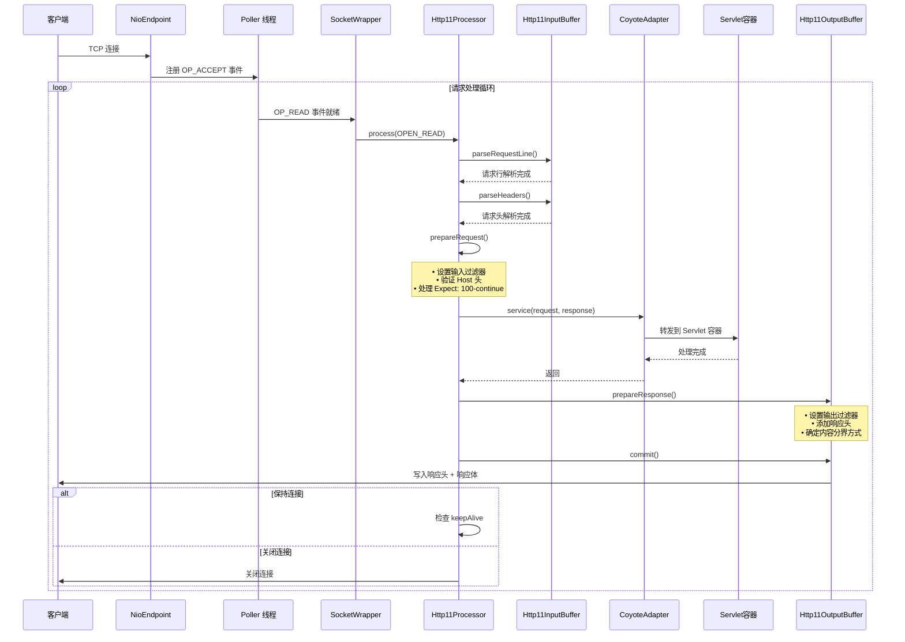
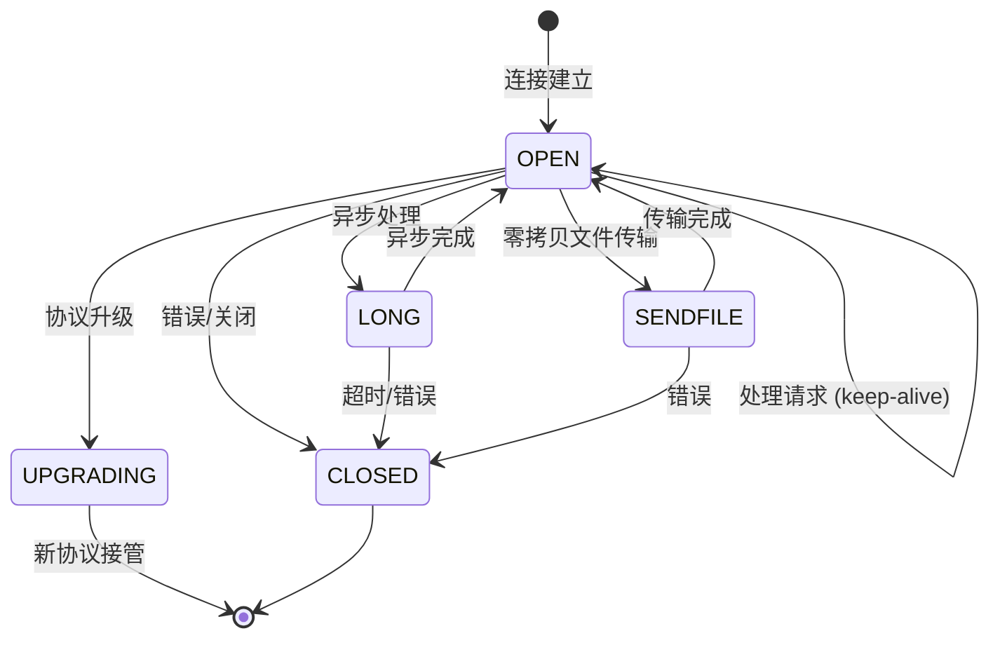

# Coyote 请求响应处理过程详解

## 概述

本文档详细分析 Coyote 模块中 HTTP 请求和响应的完整处理流程，从网络 I/O 到 Servlet 容器的整个链路。

## 核心数据结构

### Request 对象

`org.apache.coyote.Request` 是 Tomcat 底层的高效请求表示，具有以下特点：

**位置**: `java/org/apache/coyote/Request.java:54`

```java
public final class Request {
    // 核心字段
    private String method;                          // HTTP 方法
    private final MessageBytes uriMB;                // 请求 URI (延迟转换)
    private final MessageBytes queryMB;              // 查询字符串
    private final MessageBytes protoMB;              // 协议版本
    private final MimeHeaders headers;               // 请求头
    private final ServerCookies serverCookies;       // Cookies
    private final Parameters parameters;             // 请求参数

    // 关键特性
    private volatile ActionHook hook;                // 动作回调
    private InputBuffer inputBuffer;                 // 输入缓冲区
    private long bytesRead = 0;                      // 已读取字节数
    private long startTimeNanos = -1;                // 请求开始时间

    // 非阻塞 I/O 支持
    volatile ReadListener listener;
    private boolean fireListener = false;
    private boolean registeredForRead = false;
}
```

**设计特点**:
- **GC 友好**: 使用 `MessageBytes` 延迟字符串转换，避免不必要的对象创建
- **零拷贝**: 通过 `InputBuffer` 接口直接处理字节流
- **非阻塞支持**: 内置 `ReadListener` 支持 Servlet 3.1+ 非阻塞 I/O

### Response 对象

`org.apache.coyote.Response` 是底层响应表示：

**位置**: `java/org/apache/coyote/Response.java:45`

```java
public final class Response {
    // 核心字段
    int status = 200;                              // 状态码
    String message = null;                          // 状态消息
    final MimeHeaders headers = new MimeHeaders(); // 响应头
    private volatile boolean committed = false;     // 已提交标志

    // 输出控制
    OutputBuffer outputBuffer;                      // 输出缓冲区
    private long contentWritten = 0;                // 已写入字节数

    // 错误状态机
    private final AtomicInteger errorState;         // 0:NONE, 1:NOT_REPORTED, 2:REPORTED

    // 非阻塞 I/O 支持
    volatile WriteListener listener;
    private boolean fireListener = false;
    private boolean registeredForWrite = false;
}
```

## 完整请求处理流程

### 流程图



### 阶段详解

#### 1. 连接接受阶段 (NioEndpoint)

**入口**: `java/org/apache/tomcat/util/net/NioEndpoint.java`

```java
// Acceptor 线程接受新连接
public void run() {
    while (!stopCalled) {
        try {
            // 接受新连接
            ServerSocketChannel serverSocket = this.serverSocket;
            SocketChannel socket = serverSocket.accept();
            socket.configureBlocking(false);

            // 注册到 Poller
            setSocketOptions(socket);
            poller.register(socket);
        } catch (IOException x) {
            // 处理异常
        }
    }
}

// Poller 线程处理 I/O 事件
public void run() {
    while (true) {
        try {
            // 轮询 I/O 事件
            if (selector.select() > 0) {
                Iterator<SelectionKey> iterator = selector.selectedKeys().iterator();
                while (iterator.hasNext()) {
                    SelectionKey sk = iterator.next();
                    SocketWrapperBase<?> socketWrapper = (SocketWrapperBase<?>) sk.attachment();

                    // 处理读事件
                    if (sk.isReadable()) {
                        processSocket(socketWrapper, SocketEvent.OPEN_READ);
                    }
                }
            }
        } catch (IOException x) {
            // 处理异常
        }
    }
}
```

#### 2. 请求解析阶段 (Http11Processor.service)

**位置**: `java/org/apache/coyote/http11/Http11Processor.java:245`

```java
public SocketState service(SocketWrapperBase<?> socketWrapper) throws IOException {
    // 初始化处理阶段
    RequestInfo rp = request.getRequestProcessor();
    rp.setStage(org.apache.coyote.Constants.STAGE_PARSE);

    setSocketWrapper(socketWrapper);
    keepAlive = true;
    openSocket = false;

    while (!getErrorState().isError() && keepAlive && !isAsync() &&
           upgradeToken == null && sendfileState == SendfileState.DONE) {

        // === 步骤 1: 解析请求行 ===
        if (!inputBuffer.parseRequestLine(keptAlive,
                protocol.getConnectionTimeout(),
                protocol.getKeepAliveTimeout())) {
            // 请求未完全到达，等待下次事件
            break;
        }

        // === 步骤 2: 确定协议版本 ===
        prepareRequestProtocol();
        // 检查是否是 HTTP/1.1 或 HTTP/1.0

        // === 步骤 3: 解析请求头 ===
        if (!inputBuffer.parseHeaders()) {
            // 请求头未完全到达
            openSocket = true;
            readComplete = false;
            break;
        }

        // === 步骤 4: 检查协议升级 ===
        if (isConnectionToken(request.getMimeHeaders(), "upgrade")) {
            String requestedProtocol = request.getHeader("Upgrade");
            UpgradeProtocol upgradeProtocol = protocol.getUpgradeProtocol(requestedProtocol);
            if (upgradeProtocol != null && upgradeProtocol.accept(request)) {
                // 处理 HTTP/2 升级等
                return SocketState.UPGRADING;
            }
        }

        // === 步骤 5: 准备请求处理 ===
        rp.setStage(org.apache.coyote.Constants.STAGE_PREPARE);
        prepareRequest();
        // - 设置输入过滤器 (chunked, identity, void)
        // - 验证 Host 头
        // - 处理 Expect: 100-continue

        // === 步骤 6: 调用 Servlet 容器 ===
        rp.setStage(org.apache.coyote.Constants.STAGE_SERVICE);
        getAdapter().service(request, response);

        // === 步骤 7: 结束请求处理 ===
        rp.setStage(org.apache.coyote.Constants.STAGE_ENDINPUT);
        if (!isAsync()) {
            endRequest();
        }

        // === 步骤 8: 准备下一个请求 ===
        rp.setStage(org.apache.coyote.Constants.STAGE_KEEPALIVE);
        inputBuffer.nextRequest();
        outputBuffer.nextRequest();
    }

    // 返回 Socket 状态
    if (isAsync()) {
        return SocketState.LONG;
    } else if (openSocket) {
        return SocketState.OPEN;
    } else {
        return SocketState.CLOSED;
    }
}
```

#### 3. 请求行解析 (Http11InputBuffer.parseRequestLine)

**位置**: `java/org/apache/coyote/http11/Http11InputBuffer.java`

```java
// 状态机解析请求行
// 请求行格式: METHOD URI PROTOCOL\r\n
boolean parseRequestLine(boolean keptAlive, int connectionTimeout,
                         int keepAliveTimeout) throws IOException {
    // 读取数据到缓冲区
    if (!fill(false)) {
        return false;
    }

    // 多阶段解析
    // Phase 0: 跳过空行 (某些客户端会发送空行)
    // Phase 1: 读取方法
    // Phase 2: 读取 URI
    // Phase 3: 读取协议版本
    // Phase 4: 读取 CRLF

    if (parsingRequestLinePhase == 0) {
        // 跳过空白字符
        byte chr = 0;
        do {
            // 读取并跳过 CR/LF
        } while ((chr == Constants.CR) || (chr == Constants.LF));
        parsingRequestLinePhase = 1;
    }

    if (parsingRequestLinePhase == 1) {
        // 解析方法: GET, POST, PUT, DELETE 等
        // 直到遇到空格
    }

    if (parsingRequestLinePhase == 2) {
        // 解析 URI
        // 直到遇到空格
    }

    if (parsingRequestLinePhase == 3) {
        // 解析协议版本: HTTP/1.1 或 HTTP/1.0
        // 直到遇到 CRLF
    }

    parsingRequestLinePhase = 4;
    parsingRequestLine = false;
    return true;
}
```

#### 4. 请求头解析 (Http11InputBuffer.parseHeaders)

```java
boolean parseHeaders() throws IOException {
    // 使用 HttpHeaderParser 解析请求头
    HeaderParseStatus status = httpHeaderParser.parseHeaders();

    while (status == HeaderParseStatus.HAVE_MORE_HEADERS) {
        // 持续解析直到完成
        status = httpHeaderParser.parseHeaders();
    }

    if (status == HeaderParseStatus.DONE) {
        parsingHeader = false;
        return true;
    }

    return false;
}
```

#### 5. 请求准备 (prepareRequest)

**位置**: `java/org/apache/coyote/http11/Http11Processor.java:612`

```java
private void prepareRequest() throws IOException {
    MimeHeaders headers = request.getMimeHeaders();

    // === 处理 Connection 头 ===
    MessageBytes connectionValueMB = headers.getValue(Constants.CONNECTION);
    if (connectionValueMB != null) {
        Set<String> tokens = new HashSet<>();
        TokenList.parseTokenList(headers.values(Constants.CONNECTION), tokens);
        if (tokens.contains(Constants.CLOSE)) {
            keepAlive = false;           // 客户端要求关闭
        } else if (tokens.contains(Constants.KEEP_ALIVE_HEADER_VALUE_TOKEN)) {
            keepAlive = true;            // 客户端要求保持连接
        }
    }

    // === 处理 Expect: 100-continue ===
    if (http11) {
        prepareExpectation(headers);
    }

    // === 验证 Host 头 (HTTP/1.1 必需) ===
    if (http11) {
        MessageBytes hostValueMB = headers.getUniqueValue("host");
        if (hostValueMB == null) {
            badRequest("http11processor.request.noHostHeader");
            return;
        }
    }

    // === 处理绝对 URI (代理请求) ===
    // 将 http://host:port/path 转换为 /path

    // === 设置输入过滤器 ===
    prepareInputFilters(headers);
}
```

**输入过滤器配置** (`prepareInputFilters` 方法，第 786 行):

```java
private void prepareInputFilters(MimeHeaders headers) throws IOException {
    contentDelimitation = false;
    InputFilter[] inputFilters = inputBuffer.getFilters();

    // === 1. 处理 Transfer-Encoding 头 ===
    MessageBytes transferEncodingValueMB = headers.getValue("transfer-encoding");
    if (transferEncodingValueMB != null) {
        List<String> encodingNames = new ArrayList<>();
        TokenList.parseTokenList(headers.values("transfer-encoding"), encodingNames);

        for (String encodingName : encodingNames) {
            addInputFilter(inputFilters, encodingName);
            // "chunked" → ChunkedInputFilter
        }
    }

    // === 2. 处理 Content-Length 头 ===
    long contentLength = request.getContentLengthLong();
    if (contentLength >= 0) {
        if (!contentDelimitation) {
            inputBuffer.addActiveFilter(inputFilters[Constants.IDENTITY_FILTER]);
            contentDelimitation = true;
        }
    }

    // === 3. 默认: 没有请求体 ===
    if (!contentDelimitation) {
        inputBuffer.addActiveFilter(inputFilters[Constants.VOID_FILTER]);
        contentDelimitation = true;
    }
}
```

**输入过滤器链**:

```
Socket Data
    ↓
ChunkedInputFilter (如果 Transfer-Encoding: chunked)
    ↓
IdentityInputFilter (如果 Content-Length 存在)
    ↓
BufferedInputFilter (用于 SSL 重新握手)
    ↓
VoidInputFilter (没有请求体时)
    ↓
Application
```

#### 6. 响应准备 (prepareResponse)

**位置**: `java/org/apache/coyote/http11/Http11Processor.java:853`

```java
protected final void prepareResponse() throws IOException {
    int statusCode = response.getStatus();

    // === 1. 根据状态码确定响应体 ===
    boolean entityBody = true;
    if (statusCode < 200 || statusCode == 204 || statusCode == 205 || statusCode == 304) {
        // 没有响应体
        outputBuffer.addActiveFilter(outputFilters[Constants.VOID_FILTER]);
        entityBody = false;
    }

    // === 2. HEAD 请求特殊处理 ===
    if (Method.HEAD.equals(request.getMethod())) {
        outputBuffer.addActiveFilter(outputFilters[Constants.VOID_FILTER]);
    }

    // === 3. 确定内容分界方式 ===
    long contentLength = response.getContentLengthLong();

    if (contentLength != -1) {
        // 使用 Content-Length
        headers.setValue("Content-Length").setLong(contentLength);
        outputBuffer.addActiveFilter(outputFilters[Constants.IDENTITY_FILTER]);
        contentDelimitation = true;
    } else if (http11 && entityBody) {
        // 使用 Transfer-Encoding: chunked (HTTP/1.1)
        outputBuffer.addActiveFilter(outputFilters[Constants.CHUNKED_FILTER]);
        headers.addValue(Constants.TRANSFERENCODING).setString(Constants.CHUNKED);
        contentDelimitation = true;
    } else {
        // 使用连接关闭表示结束
        keepAlive = false;
    }

    // === 4. 检查压缩 ===
    boolean useCompression = protocol.useCompression(request, response);
    if (useCompression) {
        outputBuffer.addActiveFilter(outputFilters[Constants.GZIP_FILTER]);
    }

    // === 5. 添加 Date 头 ===
    if (headers.getValue("Date") == null) {
        headers.addValue("Date").setString(FastHttpDateFormat.getCurrentDate());
    }

    // === 6. 处理 Connection 头 ===
    if (!keepAlive) {
        headers.addValue(Constants.CONNECTION).setString(Constants.CLOSE);
    } else if (http11 && !getErrorState().isError()) {
        // HTTP/1.1 默认保持连接
        // 可能添加 Keep-Alive 超时信息
    }

    // === 7. 写入响应头 ===
    writeHeaders(response.getStatus(), headers);
    outputBuffer.commit();
}
```

**输出过滤器链**:

```
Application Data
    ↓
GzipOutputFilter (如果启用压缩)
    ↓
ChunkedOutputFilter (如果 Transfer-Encoding: chunked)
    ↓
IdentityOutputFilter (如果 Content-Length 存在)
    ↓
VoidOutputFilter (没有响应体时)
    ↓
Socket
```

#### 7. 响应提交 (Http11OutputBuffer.commit)

**位置**: `java/org/apache/coyote/http11/Http11OutputBuffer.java:36`

```java
// 将响应头写入 Socket
void sendHeaders() throws IOException {
    // 写入状态行: HTTP/1.1 200 OK\r\n
    write(statusLine);

    // 写入所有响应头
    for (int i = 0; i < headers.size(); i++) {
        write(headers.getName(i));
        write(": ");
        write(headers.getValue(i));
        write("\r\n");
    }

    // 结束头: \r\n
    write("\r\n");

    // 刷新到 Socket
    socketWrapper.flush(true);
}
```

#### 8. 响应体写入 (doWrite)

```java
// Http11OutputBuffer.doWrite()
public int doWrite(ByteBuffer chunk) throws IOException {
    if (!response.isCommitted()) {
        // 首次写入时自动提交响应头
        response.action(ActionCode.COMMIT, null);
    }

    if (lastActiveFilter == -1) {
        return outputStreamOutputBuffer.doWrite(chunk);
    } else {
        return activeFilters[lastActiveFilter].doWrite(chunk);
    }
}
```

## 关键状态机

### Socket 状态机



**状态定义** (`org.apache.tomcat.util.net.AbstractEndpoint.Handler.SocketState`):

```java
enum SocketState {
    OPEN,       // 连接保持打开，可以处理下一个请求
    LONG,       // 异步处理或长连接
    CLOSED,     // 连接关闭
    UPGRADING,  // 协议升级 (如 HTTP/2)
    SENDFILE    // 零拷贝文件传输
}
```

### 请求处理阶段

```java
// RequestInfo.STAGE
int STAGE_PARSE = 0;        // 解析请求行和头
int STAGE_PREPARE = 1;      // 准备请求处理
int STAGE_SERVICE = 2;      // 调用 Servlet
int STAGE_ENDINPUT = 3;     // 结束输入
int STAGE_ENDOUTPUT = 4;    // 结束输出
int STAGE_KEEPALIVE = 5;    // 保持连接
int STAGE_ENDED = 6;        // 处理结束
```

## 过滤器机制详解

### 输入过滤器接口

**位置**: `java/org/apache/coyote/http11/InputFilter.java`

```java
public interface InputFilter {
    // 读取数据到处理器
    int doRead(ApplicationBufferHandler handler) throws IOException;

    // 设置请求关联
    void setRequest(Request request);

    // 响应结束，计算字节数
    long end() throws IOException;

    // 获取可用字节数
    int available();

    // 重置过滤器状态
    void recycle();

    // 获取编码名称 (如 "chunked", "identity")
    MessageBytes getEncodingName();

    // 设置底层输入缓冲区
    void setBuffer(InputBuffer buffer);
}
```

### ChunkedInputFilter 实现

**位置**: `java/org/apache/coyote/http11/filters/ChunkedInputFilter.java`

```java
public class ChunkedInputFilter implements InputFilter {
    // 解析分块编码格式:
    // [chunk size in hex]\r\n
    // [chunk data]\r\n
    // 0\r\n\r\n

    private int remaining = 0;       // 当前块剩余字节数
    private boolean chunked = false; // 是否使用分块编码

    @Override
    public int doRead(ApplicationBufferHandler handler) throws IOException {
        if (remaining <= 0) {
            // 解析下一个块的大小
            parseChunkHeader();
            if (remaining == 0) {
                // 最后一个块，解析 trailer 头
                parseTrailerHeaders();
                return -1;
            }
        }

        // 读取块数据
        int result = 0;
        if (remaining > 0) {
            int newSize = Math.min(remaining, handler.getByteBuffer().remaining());
            result = buffer.doRead(handler);
            if (result > 0) {
                remaining -= result;
            }
        }

        return result;
    }
}
```

### GzipOutputFilter 实现

**位置**: `java/org/apache/coyote/http11/filters/GzipOutputFilter.java`

```java
public class GzipOutputFilter implements OutputFilter {
    private GZIPOutputStream compressionOutputStream = null;

    @Override
    public int doWrite(ByteBuffer chunk) throws IOException {
        // 压缩数据
        byte[] data = new byte[chunk.remaining()];
        chunk.get(data);

        compressionOutputStream.write(data);

        // 返回压缩前的字节数 (用于统计)
        return data.length;
    }

    @Override
    public long end() throws IOException {
        // 完成 GZIP 流
        compressionOutputStream.finish();
        return compressionOutputStream.getBytesWritten();
    }
}
```

## 性能优化技术

### 1. 对象池化

**位置**: `org.apache.coyote.AbstractProtocol`

```java
// RecycledProcessors 扩展 SynchronizedStack
private final RecycledProcessors recycledProcessors = new RecycledProcessors(this);

// 获取 Processor
Processor getProcessor() {
    // 尝试从池中获取
    Processor processor = recycledProcessors.pop();
    if (processor == null) {
        // 创建新的
        processor = createProcessor();
    }
    return processor;
}

// 回收 Processor
void recycle(Processor processor) {
    recycledProcessors.push(processor);
}
```

### 2. 延迟字符串转换

**MessageBytes** 实现了从字节到字符串的延迟转换：

```java
public class MessageBytes {
    private int type = T_BYTES;      // T_BYTES 或 T_CHARS
    private ByteChunk byteC = null;   // 字节数据
    private CharChunk charC = null;   // 字符数据
    private String strValue = null;   // 字符串 (延迟计算)

    public String toString() {
        if (strValue == null) {
            if (type == T_BYTES) {
                strValue = byteC.toString(); // 首次调用时转换
            } else {
                strValue = charC.toString();
            }
        }
        return strValue;
    }
}
```

### 3. 零拷贝文件传输

通过 Sendfile 实现：

```java
// 在 prepareResponse() 中
if (protocol.getUseSendfile()) {
    String fileName = (String) request.getAttribute(
        org.apache.coyote.Constants.SENDFILE_FILENAME_ATTR);
    if (fileName != null) {
        sendfileData = socketWrapper.createSendfileData(fileName, pos, len);
    }
}

// 在 processSendfile() 中
private SendfileState processSendfile(SocketWrapperBase<?> socketWrapper) {
    if (sendfileData != null) {
        return socketWrapper.processSendfile(sendfileData);
        // 使用操作系统的 sendfile 系统调用
        // 实现零拷贝文件传输
    }
    return SendfileState.DONE;
}
```

### 4. 非阻塞 I/O

**位置**: `java/org/apache/coyote/Request.java` 和 `Response.java`

```java
// 非阻塞读
public boolean isReady() {
    boolean ready;
    synchronized (nonBlockingStateLock) {
        if (registeredForRead) {
            fireListener = true;
            return false;
        }
        ready = checkRegisterForRead();
        fireListener = !ready;
    }
    return ready;
}

// 注册读回调
public void setReadListener(ReadListener listener) {
    this.listener = listener;
    if (!isFinished() && isReady()) {
        // 触发异步调度
        action(ActionCode.DISPATCH_READ, null);
    }
}
```

## 错误处理

### 错误状态机

**位置**: `java/org/apache/coyote/Response.java:149`

```java
private final AtomicInteger errorState = new AtomicInteger(0);

// 状态转换:
// 0 (NONE) → 1 (NOT_REPORTED) → 2 (REPORTED)

public void setError() {
    errorState.compareAndSet(0, 1);  // NONE → NOT_REPORTED
}

public boolean isErrorReportRequired() {
    return errorState.get() == 1;
}

public boolean setErrorReported() {
    return errorState.compareAndSet(1, 2);  // NOT_REPORTED → REPORTED
}
```

### 错误处理流程

```java
// 在 Http11Processor.service() 中
try {
    getAdapter().service(request, response);
} catch (Throwable t) {
    // 1. 设置响应状态码
    response.setStatus(500);

    // 2. 设置错误状态
    setErrorState(ErrorState.CLOSE_CLEAN, t);

    // 3. 记录日志
    log.error(sm.getString("http11processor.request.process"), t);

    // 4. 写入错误页面
    getAdapter().log(request, response, 0);
}
```

## 关键文件索引

| 文件 | 行号 | 描述 |
|------|------|------|
| Request.java | 54 | 请求对象定义 |
| Response.java | 45 | 响应对象定义 |
| Processor.java | 30 | 处理器接口 |
| Adapter.java | 26 | 适配器接口 |
| Http11Processor.java | 72 | HTTP/1.1 处理器 |
| Http11Processor.java | 245 | service() 方法 |
| Http11Processor.java | 612 | prepareRequest() 方法 |
| Http11Processor.java | 853 | prepareResponse() 方法 |
| Http11InputBuffer.java | 42 | 输入缓冲区 |
| Http11OutputBuffer.java | 36 | 输出缓冲区 |
| ChunkedInputFilter.java | | 分块输入过滤器 |
| GzipOutputFilter.java | | GZIP 输出过滤器 |

---

*文档位置：`./AnalysisDocs/coyote-request-response-processing.md`*
*Tomcat Coyote 请求响应处理过程深度分析*
